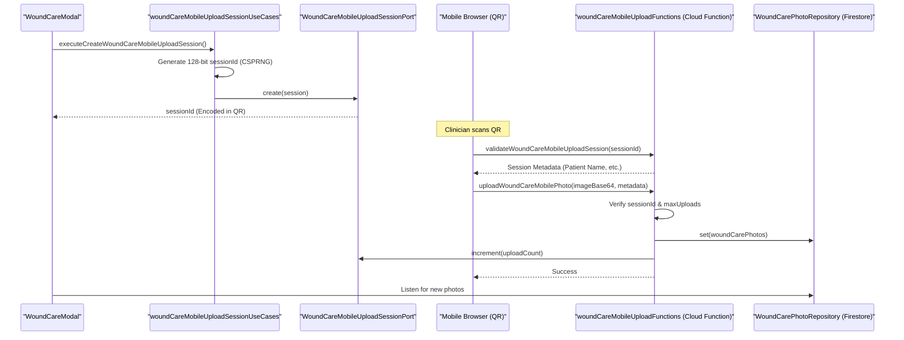
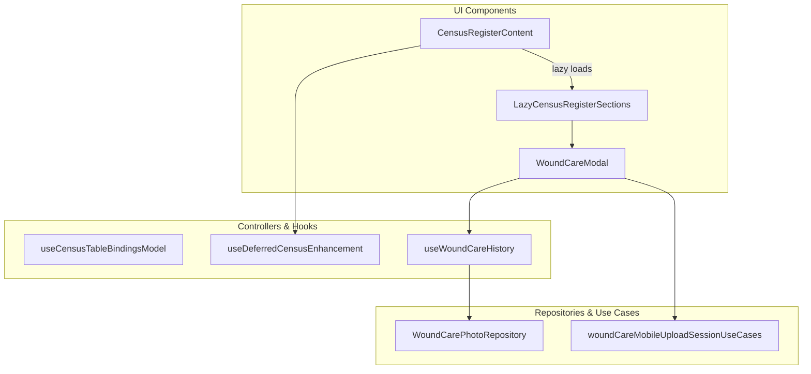

# Wound Care Module

# Wound Care Module

Relevant source files

The following files were used as context for generating this wiki page:

- [docs/superpowers/plans/2026-05-02-wound-care-mobile-qr-upload.md](docs/superpowers/plans/2026-05-02-wound-care-mobile-qr-upload.md)
- [functions/lib/woundCareMobileUploadFunctions.js](functions/lib/woundCareMobileUploadFunctions.js)
- [scripts/feature-dependency-matrix.json](scripts/feature-dependency-matrix.json)
- [src/application/ports/woundCarePort.ts](src/application/ports/woundCarePort.ts)
- [src/application/wound-care/woundCareConsentUseCases.ts](src/application/wound-care/woundCareConsentUseCases.ts)
- [src/application/wound-care/woundCareMobileUploadSessionUseCases.ts](src/application/wound-care/woundCareMobileUploadSessionUseCases.ts)
- [src/application/wound-care/woundCarePhotoUseCases.ts](src/application/wound-care/woundCarePhotoUseCases.ts)
- [src/application/wound-care/woundCareUseCaseHelpers.ts](src/application/wound-care/woundCareUseCaseHelpers.ts)
- [src/application/wound-care/woundCareUseCases.ts](src/application/wound-care/woundCareUseCases.ts)
- [src/components/ui/Skeleton.tsx](src/components/ui/Skeleton.tsx)
- [src/components/ui/ViewLoader.tsx](src/components/ui/ViewLoader.tsx)
- [src/features/census/components/CensusRegisterContent.tsx](src/features/census/components/CensusRegisterContent.tsx)
- [src/features/census/components/CensusRegisterSections.tsx](src/features/census/components/CensusRegisterSections.tsx)
- [src/features/census/components/patient-row/NameInput.tsx](src/features/census/components/patient-row/NameInput.tsx)
- [src/features/census/hooks/useCensusTableBindingsModel.ts](src/features/census/hooks/useCensusTableBindingsModel.ts)
- [src/features/census/hooks/useClinicalDocumentPresenceByBed.ts](src/features/census/hooks/useClinicalDocumentPresenceByBed.ts)
- [src/features/census/hooks/useDeferredCensusEnhancement.ts](src/features/census/hooks/useDeferredCensusEnhancement.ts)
- [src/features/wound-care/components/PhotoUploadModal.tsx](src/features/wound-care/components/PhotoUploadModal.tsx)
- [src/features/wound-care/controllers/photoUploadController.ts](src/features/wound-care/controllers/photoUploadController.ts)
- [src/features/wound-care/public.ts](src/features/wound-care/public.ts)
- [src/schemas/zod/woundCare.ts](src/schemas/zod/woundCare.ts)
- [src/services/repositories/WoundCarePhotoRepository.ts](src/services/repositories/WoundCarePhotoRepository.ts)
- [src/tests/application/wound-care/woundCareMobileUploadSessionUseCases.test.ts](src/tests/application/wound-care/woundCareMobileUploadSessionUseCases.test.ts)
- [src/tests/features/census/useClinicalDocumentPresenceByBed.test.tsx](src/tests/features/census/useClinicalDocumentPresenceByBed.test.tsx)
- [src/tests/features/clinical-documents/clinicalDocumentPdfRenderService.test.ts](src/tests/features/clinical-documents/clinicalDocumentPdfRenderService.test.ts)
- [src/tests/functions/woundCareMobileUploadFunctions.test.ts](src/tests/functions/woundCareMobileUploadFunctions.test.ts)
- [src/tests/services/repositories/patientMasterContracts.test.ts](src/tests/services/repositories/patientMasterContracts.test.ts)
- [src/tests/views/census/CensusRegisterContent.test.tsx](src/tests/views/census/CensusRegisterContent.test.tsx)
- [src/tests/views/census/CensusTable.clinical-indicators.test.tsx](src/tests/views/census/CensusTable.clinical-indicators.test.tsx)
- [src/tests/views/census/NameInput.test.tsx](src/tests/views/census/NameInput.test.tsx)
- [src/tests/views/census/useCensusTableBindingsModel.test.ts](src/tests/views/census/useCensusTableBindingsModel.test.ts)
- [src/types/domain/woundCare.ts](src/types/domain/woundCare.ts)

The Wound Care module provides specialized functionality for documenting and tracking patient wounds through photography and clinical metadata. It features a secure mobile upload flow via QR codes, allowing clinicians to use mobile devices for high-quality photo capture without storing sensitive medical data on the physical device.

## Overview and Data Flow

The module is structured to support both desktop management and mobile capture. The core flow involves generating a short-lived, cryptographically secure session that allows a mobile device to upload photos directly to the system's cloud storage and Firestore database.

### Photo Upload Sequence

The following diagram illustrates the lifecycle of a wound care photo capture session, from QR generation to final storage.

**Wound Care Capture Flow**

Sources: [src/application/wound-care/woundCareMobileUploadSessionUseCases.ts:49-86](), [src/tests/functions/woundCareMobileUploadFunctions.test.ts:155-198](), [src/application/wound-care/woundCareMobileUploadSessionUseCases.ts:17-24]()

## Mobile Upload Sessions

To maintain security, mobile upload sessions are ephemeral and strictly scoped.

- **Session TTL**: Sessions are valid for 30 minutes [src/application/wound-care/woundCareMobileUploadSessionUseCases.ts:17-17]().
- **Entropy**: Session IDs are generated using `crypto.getRandomValues` to ensure 128-bit entropy [src/application/wound-care/woundCareMobileUploadSessionUseCases.ts:32-42]().
- **Rate Limiting**: Each session is capped at 50 uploads to prevent resource exhaustion or abuse [src/application/wound-care/woundCareMobileUploadSessionUseCases.ts:24-24]().
- **Scope**: Sessions are restricted to `wound_care_upload_only` [src/application/wound-care/woundCareMobileUploadSessionUseCases.ts:69-69]().

### Session Use Cases

The `woundCareMobileUploadSessionUseCases.ts` file implements the core logic for session management:

- `executeCreateWoundCareMobileUploadSession`: Initializes a new session for a specific patient episode [src/application/wound-care/woundCareMobileUploadSessionUseCases.ts:49-56]().
- `executeValidateWoundCareMobileUploadSession`: Checks if a session exists, is not revoked, and has not expired [src/application/wound-care/woundCareMobileUploadSessionUseCases.ts:88-129]().
- `executeRevokeWoundCareMobileUploadSession`: Manually terminates a session [src/application/wound-care/woundCareMobileUploadSessionUseCases.ts:131-155]().

Sources: [src/application/wound-care/woundCareMobileUploadSessionUseCases.ts:1-156]()

## Backend Implementation: Cloud Functions

The `woundCareMobileUploadFunctions` (Firebase Cloud Functions) handles the bridge between the mobile client and the secure internal infrastructure.

| Function                               | Responsibility                                                                 | Security Checks                     |
| :------------------------------------- | :----------------------------------------------------------------------------- | :---------------------------------- |
| `validateWoundCareMobileUploadSession` | Returns patient context to the mobile device.                                  | Expiry, Revocation status.          |
| `uploadWoundCareMobilePhoto`           | Processes Base64 images, generates thumbnails, and saves to Storage/Firestore. | Session validity, `maxUploads` cap. |

The upload function specifically enforces the `maxUploads` cap per session to prevent a leaked QR link from being used to flood patient storage [src/tests/functions/woundCareMobileUploadFunctions.test.ts:200-218]().

Sources: [src/tests/functions/woundCareMobileUploadFunctions.test.ts:113-222](), [functions/lib/woundCareMobileUploadFunctions.js:1-21]()

## Integration with Census

The Wound Care module is integrated into the Census view via deferred enhancements. The `useCensusTableBindingsModel` hook determines if a user has the required permissions to interact with clinical documentation and wound care [src/features/census/hooks/useCensusTableBindingsModel.ts:40-43]().

### Deferred Loading

To maintain performance, secondary sections like Wound Care are loaded lazily using the `useDeferredCensusEnhancement` hook [src/features/census/components/CensusRegisterContent.tsx:43-43]().

**Component Integration Map**

Sources: [src/features/census/components/CensusRegisterContent.tsx:13-17](), [src/features/census/hooks/useCensusTableBindingsModel.ts:33-43](), [src/features/census/components/CensusRegisterContent.tsx:60-76]()

## Domain Entities and Repositories

### WoundCarePhotoRepository

This repository manages the persistence of photo metadata in Firestore. It handles:

- Listing photos for a specific patient episode.
- Saving metadata including body location, description, and upload source (mobile vs desktop).
- Managing soft deletes or archival of photos.

### Data Contracts

- **WoundCareMobileUploadSession**: Defines the structure for the QR-based session [src/types/domain/woundCare.ts:1-10]().
- **WoundCareAuditActor**: Represents the clinician initiating the session for audit trail purposes [src/types/domain/woundCare.ts:11-16]().

Sources: [src/application/ports/woundCarePort.ts:7-10](), [src/services/repositories/WoundCarePhotoRepository.ts:1-20]()

---
