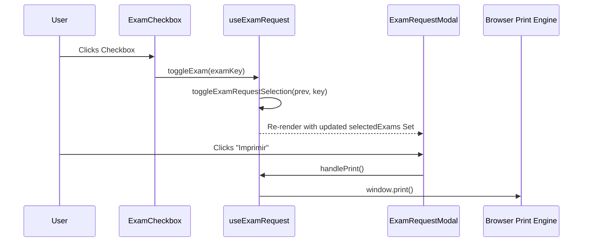
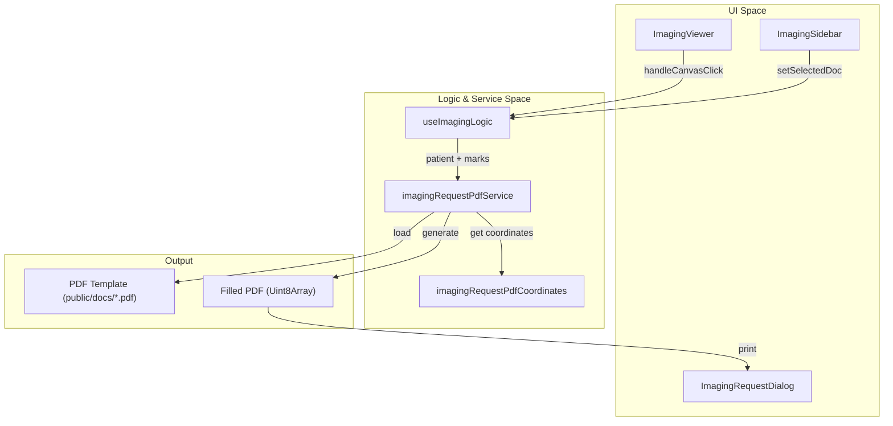

# Exam & Imaging Requests

# Exam & Imaging Requests

Relevant source files

The following files were used as context for generating this wiki page:

- [Formularios/pdffieldencuestacontraste.json](Formularios/pdffieldencuestacontraste.json)
- [public/docs/encuesta_imagenologia.png](public/docs/encuesta_imagenologia.png)
- [src/components/exam-request/ExamCheckbox.tsx](src/components/exam-request/ExamCheckbox.tsx)
- [src/components/exam-request/ExamFormHeader.tsx](src/components/exam-request/ExamFormHeader.tsx)
- [src/components/exam-request/ExamMetadata.tsx](src/components/exam-request/ExamMetadata.tsx)
- [src/components/exam-request/ExamPatientInfo.tsx](src/components/exam-request/ExamPatientInfo.tsx)
- [src/components/layout/date-strip/MedicalIndicationsDialog.tsx](src/components/layout/date-strip/MedicalIndicationsDialog.tsx)
- [src/components/modals/ExamRequestModal.tsx](src/components/modals/ExamRequestModal.tsx)
- [src/components/modals/ImagingRequestDialog.tsx](src/components/modals/ImagingRequestDialog.tsx)
- [src/components/modals/controllers/imagingRequestDialogController.ts](src/components/modals/controllers/imagingRequestDialogController.ts)
- [src/components/modals/controllers/imagingViewerController.ts](src/components/modals/controllers/imagingViewerController.ts)
- [src/components/modals/imaging/ImagingSidebar.tsx](src/components/modals/imaging/ImagingSidebar.tsx)
- [src/components/modals/imaging/ImagingViewer.tsx](src/components/modals/imaging/ImagingViewer.tsx)
- [src/components/modals/imaging/useImagingLogic.ts](src/components/modals/imaging/useImagingLogic.ts)
- [src/constants/examCategories.ts](src/constants/examCategories.ts)
- [src/context/StaffContext.tsx](src/context/StaffContext.tsx)
- [src/features/clinical-documents/services/clinicalDocumentBackendExportService.ts](src/features/clinical-documents/services/clinicalDocumentBackendExportService.ts)
- [src/features/clinical-documents/services/clinicalDocumentPdfRenderService.ts](src/features/clinical-documents/services/clinicalDocumentPdfRenderService.ts)
- [src/hooks/useExamRequest.ts](src/hooks/useExamRequest.ts)
- [src/services/admin/attributionService.ts](src/services/admin/attributionService.ts)
- [src/services/handoff/publicMedicalSignatureService.ts](src/services/handoff/publicMedicalSignatureService.ts)
- [src/services/pdf/imagingRequestPdfService.ts](src/services/pdf/imagingRequestPdfService.ts)
- [src/services/pdf/pdfBrowserUtils.ts](src/services/pdf/pdfBrowserUtils.ts)
- [src/tests/components/ExamRequestModal.integration.test.tsx](src/tests/components/ExamRequestModal.integration.test.tsx)
- [src/tests/components/exam-request/ExamCheckbox.test.tsx](src/tests/components/exam-request/ExamCheckbox.test.tsx)
- [src/tests/components/exam-request/ExamPatientInfo.test.tsx](src/tests/components/exam-request/ExamPatientInfo.test.tsx)
- [src/tests/components/imagingRequestDialogController.test.ts](src/tests/components/imagingRequestDialogController.test.ts)
- [src/tests/components/imagingViewerController.test.ts](src/tests/components/imagingViewerController.test.ts)
- [src/tests/context/UIContext.test.tsx](src/tests/context/UIContext.test.tsx)
- [src/tests/features/clinical-documents/clinicalDocumentBackendExportService.test.ts](src/tests/features/clinical-documents/clinicalDocumentBackendExportService.test.ts)
- [src/tests/features/laboratory/LaboratoryQuickAction.test.tsx](src/tests/features/laboratory/LaboratoryQuickAction.test.tsx)

The **Exam & Imaging Requests** module provides clinical staff with tools to generate standardized laboratory and radiology requests. These tools bridge the gap between digital patient records and the physical/legacy workflows of the hospital by generating high-fidelity PDF replicas and printable forms.

## 1. Laboratory Exam Requests

The laboratory request system is centered around `ExamRequestModal`, which allows doctors and nurses to select specific exams from the official Hospital Hanga Roa catalog.

### Implementation Details

The system uses a modular approach to render a complex, printable form that matches the physical paper version used in the hospital.

- **`ExamRequestModal`**: The main container that uses `BaseModal` with `printable={true}` [src/components/modals/ExamRequestModal.tsx:113-116](). It orchestrates the rendering of the institutional header, patient information, and the exam grid.
- **`useExamRequest`**: A custom hook that manages the state of selected exams (using a `Set<string>`), patient provenance (`procedencia`), and insurance (`prevision`) [src/hooks/useExamRequest.ts:37-41]().
- **`EXAM_CATEGORIES`**: A static definition of all available laboratory tests grouped by laboratory area (e.g., Bioquímica, Hematología) and associated tube types [src/constants/examCategories.ts:13-120]().

### Data Flow: Exam Selection to Print

The following diagram illustrates how the selection of an exam updates the UI and prepares the document for printing.

**Laboratory Request Flow**

_Sources: [src/components/modals/ExamRequestModal.tsx:56-64](), [src/hooks/useExamRequest.ts:56-62](), [src/components/exam-request/ExamCheckbox.tsx:25-31]()_

### Components

- **`ExamCheckbox`**: Renders a custom checkbox that displays a bold "X" when selected, ensuring visibility in black-and-white printouts [src/components/exam-request/ExamCheckbox.tsx:32-55]().
- **`ExamPatientInfo`**: Formats patient identity data (RUT, Name, Age) into the specific layout required by the laboratory form [src/components/exam-request/ExamPatientInfo.tsx:20-67]().
- **`ExamFormHeader`**: Displays the "Hospital Hanga Roa" and "Red Salud Oriente" institutional logos [src/components/exam-request/ExamFormHeader.tsx:8-43]().

## 2. Imaging Requests & Consent

The Imaging module handles more complex documents, including radiology requests, contrast surveys, and informed consents. Unlike the laboratory form, which is a React-rendered HTML grid, the imaging system uses PDF template injection.

### Imaging Architecture

The module consists of a viewer that allows interactive marking (placing "X" or text) directly onto a visual representation of the PDF.

- **`ImagingRequestDialog`**: The shell component that hosts the sidebar and viewer [src/components/modals/ImagingRequestDialog.tsx:13-17]().
- **`ImagingViewer`**: Renders an image of the PDF template and overlays interactive elements. It calculates positions using percentages to maintain coordinate integrity across different screen sizes [src/components/modals/imaging/ImagingViewer.tsx:34-40]().
- **`imagingRequestPdfService`**: The core service responsible for loading PDF templates and injecting data into specific coordinates [src/services/pdf/imagingRequestPdfService.ts:1-9]().

### PDF Injection Engine

The system uses `pdf-lib` via `imagingRequestPdfService` to modify official PDF files located in `/public/docs/`.

| Function                 | Template Path                | Purpose                                                                                                 |
| :----------------------- | :--------------------------- | :------------------------------------------------------------------------------------------------------ |
| `fillImagingRequestForm` | `/docs/solicitud-imagen.pdf` | Standard radiology request [src/services/pdf/imagingRequestPdfService.ts:152-166]()                     |
| `fillConsentimientoForm` | `/docs/consentimiento.pdf`   | Legal informed consent [src/services/pdf/imagingRequestPdfService.ts:171-184]()                         |
| `drawCustomMarks`        | N/A                          | Injects user-placed "X" or text at coordinates [src/services/pdf/imagingRequestPdfService.ts:132-132]() |

**Imaging PDF Generation Flow**

_Sources: [src/components/modals/ImagingRequestDialog.tsx:18-34](), [src/services/pdf/imagingRequestPdfService.ts:97-136](), [src/components/modals/imaging/ImagingViewer.tsx:28-40]()_

### Interactive Marking

The `ImagingViewer` allows users to interact with the document before printing:

1. **Tool Modes**: Users can toggle between `cross` (placing an X) and `text` (typing custom annotations) [src/components/modals/imaging/ImagingSidebar.tsx:112-133]().
2. **Coordinate Mapping**: Clicks on the `ImagingViewer` are captured and stored as `CustomMark` objects containing `x` and `y` percentages [src/components/modals/imaging/ImagingViewer.tsx:74-77]().
3. **PDF Drawing**: When printing, these percentages are translated into PDF points by `drawCustomMarks` in the service layer [src/services/pdf/imagingRequestPdfService.ts:132-132]().

## 3. Data Integrity & Mapping

To ensure patient data correctly aligns with the pre-printed boxes on official forms, the system uses a coordinate-based mapping strategy.

- **Field Definitions**: Coordinates for names, RUTs, and dates are defined in `imagingRequestPdfCoordinates` [src/services/pdf/imagingRequestPdfService.ts:19-22]().
- **Uppercase Normalization**: All text injected into imaging PDFs is automatically converted to uppercase to match institutional standards via `createUppercaseTextDrawer` [src/services/pdf/imagingRequestPdfService.ts:117-117]().
- **Patient Identity Splitting**: The service uses `splitPatientName` to separate a single name string into First Name, Father's Last Name, and Mother's Last Name to fill separate boxes on the form [src/services/pdf/imagingRequestPdfService.ts:60-64]().

_Sources: [src/services/pdf/imagingRequestPdfService.ts:49-71](), [src/components/modals/controllers/imagingRequestDialogController.ts:8-11]()_

---
