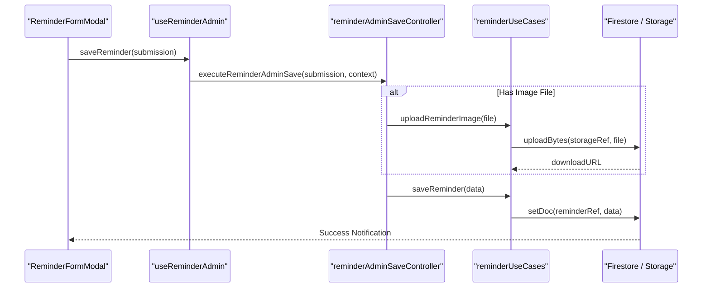
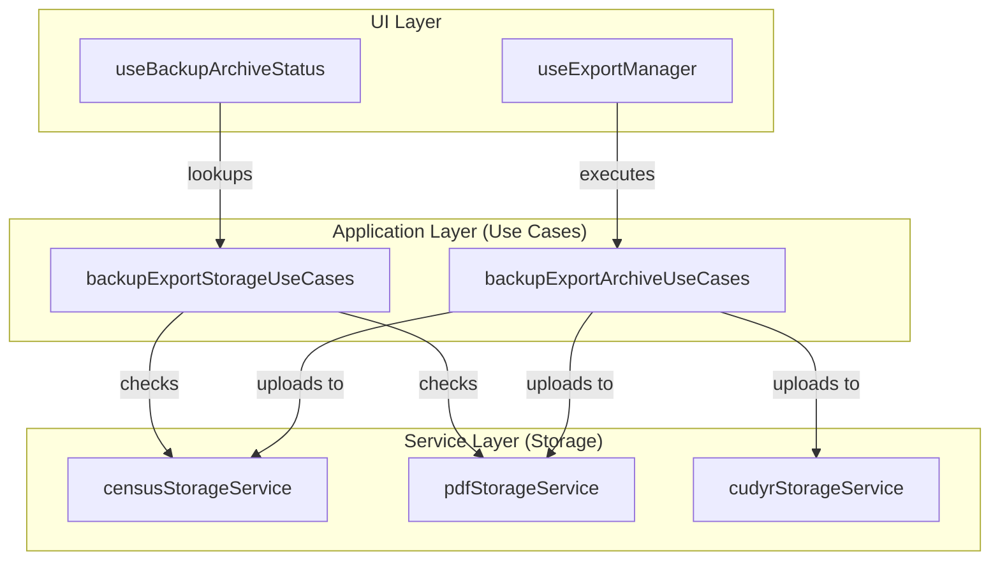

# Reminders & Backup/Export

# Reminders & Backup/Export

Relevant source files

The following files were used as context for generating this wiki page:

- [docs/superpowers/plans/2026-04-20-cimientos-roadmap-board.md](docs/superpowers/plans/2026-04-20-cimientos-roadmap-board.md)
- [e2e/authenticated-clinical-smoke.spec.ts](e2e/authenticated-clinical-smoke.spec.ts)
- [src/application/auth/authSessionContracts.ts](src/application/auth/authSessionContracts.ts)
- [src/application/backup-export/backupExportArchiveContracts.ts](src/application/backup-export/backupExportArchiveContracts.ts)
- [src/application/backup-export/backupExportArchiveUseCases.ts](src/application/backup-export/backupExportArchiveUseCases.ts)
- [src/application/backup-export/backupFilesUseCases.ts](src/application/backup-export/backupFilesUseCases.ts)
- [src/application/census/searchMasterPatientsContracts.ts](src/application/census/searchMasterPatientsContracts.ts)
- [src/application/census/searchMasterPatientsUseCase.ts](src/application/census/searchMasterPatientsUseCase.ts)
- [src/application/ports/backupFilesPort.ts](src/application/ports/backupFilesPort.ts)
- [src/application/reminders/reminderUseCases.ts](src/application/reminders/reminderUseCases.ts)
- [src/components/layout/SyncStatusIndicator.tsx](src/components/layout/SyncStatusIndicator.tsx)
- [src/components/layout/UserMenu.tsx](src/components/layout/UserMenu.tsx)
- [src/context/ReminderCenterContext.tsx](src/context/ReminderCenterContext.tsx)
- [src/features/backup/README.md](src/features/backup/README.md)
- [src/features/census/components/global-search/usePatientSearchQuery.ts](src/features/census/components/global-search/usePatientSearchQuery.ts)
- [src/features/reminders/components/admin/ReminderFormModal.tsx](src/features/reminders/components/admin/ReminderFormModal.tsx)
- [src/features/reminders/controllers/reminderAdminSaveController.ts](src/features/reminders/controllers/reminderAdminSaveController.ts)
- [src/features/reminders/hooks/useReminderAdmin.ts](src/features/reminders/hooks/useReminderAdmin.ts)
- [src/hooks/controllers/backupStorageOutcomeController.ts](src/hooks/controllers/backupStorageOutcomeController.ts)
- [src/hooks/useBackupArchiveStatus.ts](src/hooks/useBackupArchiveStatus.ts)
- [src/hooks/useBackupFileBrowserActions.ts](src/hooks/useBackupFileBrowserActions.ts)
- [src/hooks/useBackupFilesQuery.ts](src/hooks/useBackupFilesQuery.ts)
- [src/hooks/useExportManager.ts](src/hooks/useExportManager.ts)
- [src/hooks/useFileOperations.ts](src/hooks/useFileOperations.ts)
- [src/services/backup/README.md](src/services/backup/README.md)
- [src/services/backup/backupCrudResults.ts](src/services/backup/backupCrudResults.ts)
- [src/services/backup/baseStorageService.ts](src/services/backup/baseStorageService.ts)
- [src/services/backup/censusStorageService.ts](src/services/backup/censusStorageService.ts)
- [src/services/backup/cudyrStorageService.ts](src/services/backup/cudyrStorageService.ts)
- [src/services/backup/pdfStorageService.ts](src/services/backup/pdfStorageService.ts)
- [src/services/backup/storageErrorPolicy.ts](src/services/backup/storageErrorPolicy.ts)
- [src/services/repositories/repositoryConfig.ts](src/services/repositories/repositoryConfig.ts)
- [src/shared/access/operationalAccessPolicy.ts](src/shared/access/operationalAccessPolicy.ts)
- [src/shared/contracts/applicationOutcomeFactories.ts](src/shared/contracts/applicationOutcomeFactories.ts)
- [src/tests/application/auth/authSessionContracts.test.ts](src/tests/application/auth/authSessionContracts.test.ts)
- [src/tests/application/backup-export/backupExportArchiveContracts.test.ts](src/tests/application/backup-export/backupExportArchiveContracts.test.ts)
- [src/tests/application/backup-export/backupExportArchiveUseCases.test.ts](src/tests/application/backup-export/backupExportArchiveUseCases.test.ts)
- [src/tests/application/census/searchMasterPatientsContracts.test.ts](src/tests/application/census/searchMasterPatientsContracts.test.ts)
- [src/tests/application/census/searchMasterPatientsUseCase.test.ts](src/tests/application/census/searchMasterPatientsUseCase.test.ts)
- [src/tests/components/UserMenu.test.tsx](src/tests/components/UserMenu.test.tsx)
- [src/tests/emulator-ui/setup.ts](src/tests/emulator-ui/setup.ts)
- [src/tests/features/reminders/ReminderCenterContext.test.tsx](src/tests/features/reminders/ReminderCenterContext.test.tsx)
- [src/tests/features/reminders/reminderAdminSaveController.test.ts](src/tests/features/reminders/reminderAdminSaveController.test.ts)
- [src/tests/hooks/controllers/backupStorageOutcomeController.test.ts](src/tests/hooks/controllers/backupStorageOutcomeController.test.ts)
- [src/tests/hooks/useBackupFilesQuery.test.tsx](src/tests/hooks/useBackupFilesQuery.test.tsx)
- [src/tests/hooks/useExportManager.handoffNotices.test.ts](src/tests/hooks/useExportManager.handoffNotices.test.ts)
- [src/tests/hooks/useExportManager.test.ts](src/tests/hooks/useExportManager.test.ts)
- [src/tests/hooks/useFileOperations.test.ts](src/tests/hooks/useFileOperations.test.ts)
- [src/tests/services/backup/baseStorageService.test.ts](src/tests/services/backup/baseStorageService.test.ts)
- [src/tests/services/backup/censusStorageService.test.ts](src/tests/services/backup/censusStorageService.test.ts)
- [src/tests/services/backup/cudyrStorageService.test.ts](src/tests/services/backup/cudyrStorageService.test.ts)
- [src/tests/services/backup/pdfStorageRuntime.test.ts](src/tests/services/backup/pdfStorageRuntime.test.ts)
- [src/tests/services/repositoryConfig.test.ts](src/tests/services/repositoryConfig.test.ts)

This section covers the auxiliary systems for clinical communication and data persistence: the **Reminders** system (Avisos al Personal) and the **Backup/Export** infrastructure. These systems ensure that critical clinical state is both communicated in real-time and archived for administrative and legal compliance.

## 1. Reminders System (Avisos al Personal)

The Reminders system provides a centralized feed of clinical and administrative announcements. It features a real-time feed for users and an administrative interface for creating, editing, and tracking read receipts.

### Implementation Details

The system follows a clean architecture pattern where the UI interacts with a controller, which in turn invokes use cases that communicate with Firestore via a repository/port pattern.

- **`useReminderAdmin`**: The primary hook for administrative operations. It manages the state for the reminder feed, form visibility, and read receipt tracking [src/features/reminders/hooks/useReminderAdmin.ts:28-43](). It uses `reminderUseCases` to subscribe to the real-time feed [src/features/reminders/hooks/useReminderAdmin.ts:44-64]().
- **`ReminderCenterContext`**: Provides global state for the reminders UI, ensuring that the count of unread messages is consistent across the application shell.
- **`reminderUseCases`**: Encapsulates the business logic for managing reminders, including deletion of associated images in Firebase Storage when a reminder is removed [src/features/reminders/hooks/useReminderAdmin.ts:141-145]().
- **`executeReminderAdminSave`**: A controller function that orchestrates the multi-step process of saving a reminder and uploading/removing its associated image [src/features/reminders/hooks/useReminderAdmin.ts:89-95]().

### Reminder Data Flow

The following diagram illustrates the lifecycle of a reminder from creation to storage.

**Diagram: Reminder Creation and Storage Flow**

Sources: [src/features/reminders/hooks/useReminderAdmin.ts:82-125](), [src/application/reminders/reminderUseCases.ts:2-10]().

---

## 2. Backup & Export System

The application implements a robust backup system that archives clinical data in multiple formats (Excel, PDF, JSON) to Firebase Storage and local downloads.

### Storage Services

Individual services handle specific document types, implementing the `BackupStorageMutationResult` contract to provide consistent error handling [src/services/backup/backupStorageRuntimeSupport.ts:33-42]().

| Service                | Responsibility               | Storage Path                                                          |
| :--------------------- | :--------------------------- | :-------------------------------------------------------------------- |
| `censusStorageService` | Daily Census Excel archives  | `censo-diario/{year}/{month}/{DD-MM-YYYY} - Censo Diario.xlsx`        |
| `pdfStorageService`    | Handoff PDF archives         | `entregas-enfermeria/{year}/{month}/{DD-MM-YYYY} - Turno {Shift}.pdf` |
| `cudyrStorageService`  | Monthly CUDYR categorization | `cudyr/{year}/{month}/{DD-MM-YYYY} - CUDYR.xlsx`                      |

Sources: [src/services/backup/censusStorageService.ts:42-54](), [src/services/backup/pdfStorageService.ts:60-73]().

### Key Components

- **`useExportManager`**: The central hook for managing exports within the Census and Handoff views. It tracks the `isArchived` status by querying the storage services [src/hooks/useExportManager.ts:53-76]().
- **`backupExportArchiveUseCases`**: Contains the core logic for generating binaries.
  - `executeBackupCensusExcel`: Merges monthly records and uploads a generated Excel to Firebase Storage [src/application/backup-export/backupExportArchiveUseCases.ts:35-77]().
  - `executeExportHandoffPdf`: Generates a local PDF for printing using `handoffPdfGenerator` [src/application/backup-export/backupExportArchiveUseCases.ts:94-137]().
- **`useBackupArchiveStatus`**: Performs opportunistic background checks to see if a backup already exists for the current date/shift, using `requestIdleCallback` to avoid blocking the main thread [src/hooks/useBackupArchiveStatus.ts:106-114]().

### Backup Execution Logic

The system uses "Application Outcomes" to handle partial successes (e.g., PDF saved but CUDYR upload failed).

**Diagram: Backup and Export Architecture**

Sources: [src/hooks/useExportManager.ts:78-113](), [src/application/backup-export/backupExportArchiveUseCases.ts:1-30](), [src/services/backup/censusStorageService.ts:97-131]().

---

## 3. Shell Indicators & Maintenance

The application shell provides immediate feedback regarding the system's synchronization and backup status.

### UserMenu & SyncStatusIndicator

- **`UserMenu`**: Displays the authenticated user's role and the current Firebase connection state (Online, Offline, or Local Emulator) [e2e/authenticated-clinical-smoke.spec.ts:32-37]().
- **`SyncStatusIndicator`**: Visualizes the state of the persistent outbox (`syncQueueEngine`). It shows whether there are pending mutations and if the system is currently syncing with Firestore.

### File Operations (Maintenance)

The `useFileOperations` hook provides emergency data recovery and portability features:

- **JSON Export/Import**: Allows for a full database dump and restoration [src/hooks/useFileOperations.ts:58-112]().
- **CSV Export**: Generates a flat file of the current `DailyRecord` for quick analysis [src/hooks/useFileOperations.ts:73-81]().
- **Outcome Recording**: All file operations are logged via `recordOperationalOutcome` for observability [src/hooks/useFileOperations.ts:87-90]().

### Implementation Summary Table

| Feature                  | Code Entity              | Primary Responsibility                            |
| :----------------------- | :----------------------- | :------------------------------------------------ |
| **Reminders Admin**      | `useReminderAdmin`       | CRUD for announcements and image handling.        |
| **Export Orchestration** | `useExportManager`       | UI logic for PDF/Excel generation and archiving.  |
| **Storage Interaction**  | `censusStorageService`   | Firebase Storage pathing and upload/delete logic. |
| **Archive Verification** | `useBackupArchiveStatus` | Idle-time check for remote backup existence.      |
| **Manual Backups**       | `useFileOperations`      | JSON/CSV import/export for maintenance.           |

Sources: [src/hooks/useExportManager.ts:53-64](), [src/features/reminders/hooks/useReminderAdmin.ts:28-43](), [src/services/backup/censusStorageService.ts:97-105](), [src/hooks/useFileOperations.ts:36-39]().

---
