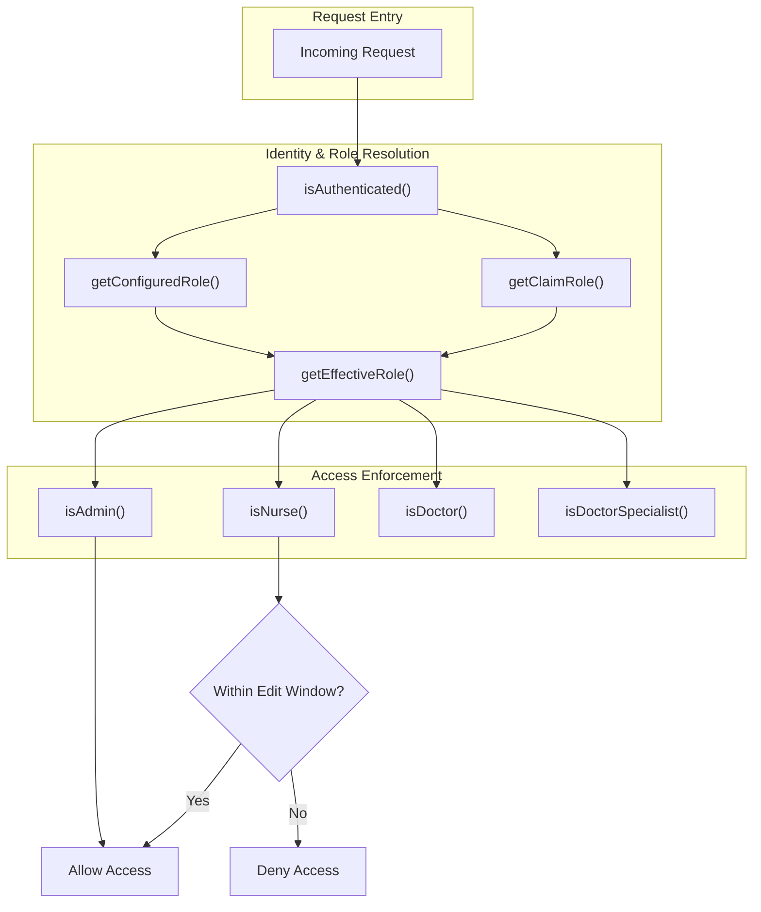
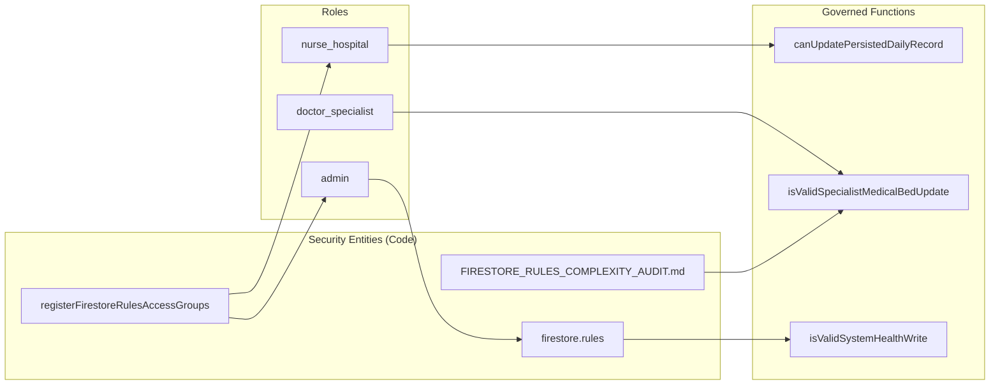

# Security & Firestore Rules

# Security & Firestore Rules

Relevant source files

The following files were used as context for generating this wiki page:

- [docs/FIRESTORE_RULES_COMPLEXITY_AUDIT.md](docs/FIRESTORE_RULES_COMPLEXITY_AUDIT.md)
- [docs/MAINTENANCE_ITERATION_LOG.md](docs/MAINTENANCE_ITERATION_LOG.md)
- [docs/OPERATIVE_RULES_REFERENCE.md](docs/OPERATIVE_RULES_REFERENCE.md)
- [docs/RUNBOOK_SECRET_ROTATION.md](docs/RUNBOOK_SECRET_ROTATION.md)
- [firestore.rules](firestore.rules)
- [functions/lib/prescriptionCleanupFunctions.js](functions/lib/prescriptionCleanupFunctions.js)
- [rules/README.md](rules/README.md)
- [rules/firestore/00-auth-and-role-helpers.rules](rules/firestore/00-auth-and-role-helpers.rules)
- [rules/firestore/30-daily-record-write-helpers.rules](rules/firestore/30-daily-record-write-helpers.rules)
- [rules/firestore/40-hospitals.rules](rules/firestore/40-hospitals.rules)
- [rules/firestore/50-global-rules.rules](rules/firestore/50-global-rules.rules)
- [rules/storage/10-storage-paths.rules](rules/storage/10-storage-paths.rules)
- [scripts/check-firestore-rules-governance.mjs](scripts/check-firestore-rules-governance.mjs)
- [scripts/check-rules-source-governance.mjs](scripts/check-rules-source-governance.mjs)
- [scripts/config/firestore-rules-governance.json](scripts/config/firestore-rules-governance.json)
- [scripts/firestoreRulesCriticalAccessMatrixSupport.mjs](scripts/firestoreRulesCriticalAccessMatrixSupport.mjs)
- [scripts/firestoreRulesGovernanceSupport.mjs](scripts/firestoreRulesGovernanceSupport.mjs)
- [scripts/hook-hotspots-limits.json](scripts/hook-hotspots-limits.json)
- [scripts/maintenanceDebtScorecardSupport.mjs](scripts/maintenanceDebtScorecardSupport.mjs)
- [scripts/report-maintenance-debt-scorecard.mjs](scripts/report-maintenance-debt-scorecard.mjs)
- [scripts/rulesSourceGovernanceSupport.mjs](scripts/rulesSourceGovernanceSupport.mjs)
- [scripts/rulesSourceSupport.mjs](scripts/rulesSourceSupport.mjs)
- [src/features/handoff/components/HandoffRowCells.tsx](src/features/handoff/components/HandoffRowCells.tsx)
- [src/features/handoff/controllers/handoffRowCellsController.ts](src/features/handoff/controllers/handoffRowCellsController.ts)
- [src/features/laboratory/controllers/labAnalyticsController.ts](src/features/laboratory/controllers/labAnalyticsController.ts)
- [src/features/prescriptions/index.ts](src/features/prescriptions/index.ts)
- [src/hooks/controllers/censusEmailRecipientRuntimeController.ts](src/hooks/controllers/censusEmailRecipientRuntimeController.ts)
- [src/hooks/useCensusEmailRecipientLists.ts](src/hooks/useCensusEmailRecipientLists.ts)
- [src/services/repositories/conflictResolutionDeviceMergeUtils.ts](src/services/repositories/conflictResolutionDeviceMergeUtils.ts)
- [src/services/repositories/conflictResolutionMatrix.ts](src/services/repositories/conflictResolutionMatrix.ts)
- [src/services/repositories/conflictResolutionMergeUtils.ts](src/services/repositories/conflictResolutionMergeUtils.ts)
- [src/services/repositories/conflictResolutionPolicy.ts](src/services/repositories/conflictResolutionPolicy.ts)
- [src/services/repositories/conflictResolutionStaffingMergeUtils.ts](src/services/repositories/conflictResolutionStaffingMergeUtils.ts)
- [src/services/repositories/conflictResolutionTrace.ts](src/services/repositories/conflictResolutionTrace.ts)
- [src/services/repositories/dailyRecordMasterSyncController.ts](src/services/repositories/dailyRecordMasterSyncController.ts)
- [src/services/repositories/dailyRecordWriteSupport.ts](src/services/repositories/dailyRecordWriteSupport.ts)
- [src/services/storage/indexeddb/indexedDbOpenHealthController.ts](src/services/storage/indexeddb/indexedDbOpenHealthController.ts)
- [src/tests/build/firestoreRulesGovernanceSupport.test.ts](src/tests/build/firestoreRulesGovernanceSupport.test.ts)
- [src/tests/build/maintenanceDebtScorecardSupport.test.ts](src/tests/build/maintenanceDebtScorecardSupport.test.ts)
- [src/tests/build/rulesSourceGovernance.test.ts](src/tests/build/rulesSourceGovernance.test.ts)
- [src/tests/build/rulesSourceSupport.test.ts](src/tests/build/rulesSourceSupport.test.ts)
- [src/tests/emulator/sync-concurrency.emulator.test.ts](src/tests/emulator/sync-concurrency.emulator.test.ts)
- [src/tests/features/census/global-search/globalSearchContracts.test.ts](src/tests/features/census/global-search/globalSearchContracts.test.ts)
- [src/tests/functions/prescriptionCleanupFunctions.test.ts](src/tests/functions/prescriptionCleanupFunctions.test.ts)
- [src/tests/hooks/controllers/censusEmailRecipientRuntimeController.test.ts](src/tests/hooks/controllers/censusEmailRecipientRuntimeController.test.ts)
- [src/tests/security/firestoreRulesAccessGroups.ts](src/tests/security/firestoreRulesAccessGroups.ts)
- [src/tests/security/firestoreRulesEmulatorConfig.test.ts](src/tests/security/firestoreRulesEmulatorConfig.test.ts)
- [src/tests/security/firestoreRulesEmulatorConfig.ts](src/tests/security/firestoreRulesEmulatorConfig.ts)
- [src/tests/security/firestoreRulesTestHarness.ts](src/tests/security/firestoreRulesTestHarness.ts)
- [src/tests/security/rulesHardeningStatic.test.ts](src/tests/security/rulesHardeningStatic.test.ts)
- [src/tests/services/repositories/conflictResolutionMatrix.test.ts](src/tests/services/repositories/conflictResolutionMatrix.test.ts)
- [src/tests/services/repositories/dailyRecordMasterSyncController.test.ts](src/tests/services/repositories/dailyRecordMasterSyncController.test.ts)
- [src/tests/services/repositories/dailyRecordRepositoryWriteServiceAutoMerge.test.ts](src/tests/services/repositories/dailyRecordRepositoryWriteServiceAutoMerge.test.ts)
- [src/tests/services/storage/indexedDbOpenHealthController.test.ts](src/tests/services/storage/indexedDbOpenHealthController.test.ts)
- [src/tests/views/handoff/handoffRowCellsController.test.ts](src/tests/views/handoff/handoffRowCellsController.test.ts)

This section provides an overview of the security architecture of the HHR system, centered on **Firestore Security Rules** and a robust **governance system** for managing them. The system ensures that clinical data is protected through Role-Based Access Control (RBAC) enforced at the database level, preventing unauthorized access or data tampering even if client-side checks are bypassed.

## Security Architecture Overview

The security model relies on Firebase Auth for identity and a custom RBAC implementation that resolves roles from two sources: custom claims in the auth token and a dynamic `config/roles` document in Firestore [firestore.rules:21-39](). This dual-source approach allows for both high-performance role checks and administrative flexibility for role recovery [docs/FIRESTORE_RULES_COMPLEXITY_AUDIT.md:104-105]().

### Core Components

| Component             | Responsibility                                                                                                                                     |
| :-------------------- | :------------------------------------------------------------------------------------------------------------------------------------------------- |
| **Firestore Rules**   | Enforces data access boundaries, write windows, and payload integrity [firestore.rules:1-200]().                                                   |
| **Governance System** | Manages rules as modular fragments with ownership and risk metadata [docs/OPERATIVE_RULES_REFERENCE.md:111-116]().                                 |
| **Test Harness**      | Provides an execution environment for verifying rules against various roles and scenarios [src/tests/security/firestoreRulesTestHarness.ts]().     |
| **Emulator Sync**     | Validates concurrency and security rules in a real-world integration environment [src/tests/emulator/sync-concurrency.emulator.test.ts:103-110](). |

### Security Logic Flow

The following diagram illustrates how a request is evaluated against the security rules based on the user's effective role.

**Security Evaluation Path**

Sources: [firestore.rules:4-63](), [firestore.rules:94-106]()

## Firestore Rules Governance

The `firestore.rules` file is a generated artifact. The source of truth resides in modular fragments within `rules/firestore/`, such as `00-auth-and-role-helpers.rules` and `40-hospitals.rules` [docs/OPERATIVE_RULES_REFERENCE.md:111-113]().

### Governance Framework

Each rule fragment is tracked in `scripts/config/firestore-rules-governance.json`, which defines:

- **Owner**: The team or module responsible for the logic.
- **Risk Level**: The impact of changes to this fragment.
- **Purpose**: A clear justification for the existence of the rule.

This system prevents the rules file from becoming an unmanageable monolith and ensures that the 1000-expression evaluation limit of Firestore is not exceeded through proactive auditing [docs/FIRESTORE_RULES_COMPLEXITY_AUDIT.md:1-5]() [docs/FIRESTORE_RULES_COMPLEXITY_AUDIT.md:93-96]().

## Security Testing & Verification

Security is verified through a tiered testing strategy:

1.  **Static Hardening Tests**: Checks for drift in constants, legacy role aliases, and root import governance [src/tests/security/rulesHardeningStatic.test.ts]().
2.  **Access Group Tests**: Validates that specific roles (nurse, doctor, specialist) can only perform allowed actions on specific collections like `auditLogs` and `dailyRecords` [src/tests/security/firestoreRulesAccessGroups.ts:23-105]().
3.  **Concurrency & Emulator Tests**: Uses the `@firebase/rules-unit-testing` library to run integration tests against the Firestore emulator, ensuring that `ConcurrencyError` is thrown when rules detect stale updates [src/tests/emulator/sync-concurrency.emulator.test.ts:148-165]().

### Role-Entity Association

This diagram maps system roles to the code entities and rules that govern their behavior.

**Role-to-Code Mapping**

Sources: [firestore.rules:49-69](), [firestore.rules:97-106](), [src/tests/security/firestoreRulesAccessGroups.ts:6-15]()

## Detailed Security Topics

For deeper technical details on the security implementation, refer to the following child pages:

- **[Firestore Security Rules](#14.1)**: Details the internal logic of the rules, including the `getEffectiveRole` resolution, the specialist write path validation (`isValidSpecialistMedicalBedUpdate`), and the 1000-expression limit optimization strategies.
- **[Security Testing & Access Groups](#14.2)**: Covers the `firestoreRulesTestHarness`, the definition of access partitions in `firestoreRulesAccessGroups`, and the sync-concurrency testing suite.

Sources: [docs/FIRESTORE_RULES_COMPLEXITY_AUDIT.md](), [firestore.rules](), [src/tests/security/firestoreRulesAccessGroups.ts](), [src/tests/emulator/sync-concurrency.emulator.test.ts]()

---
