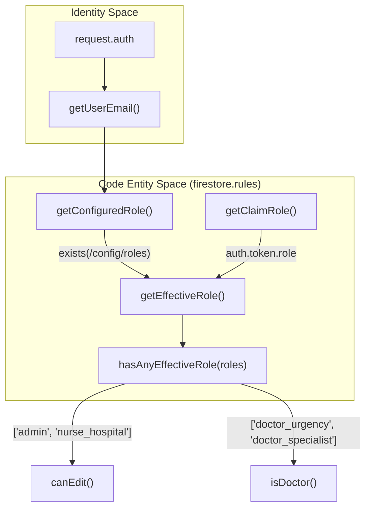
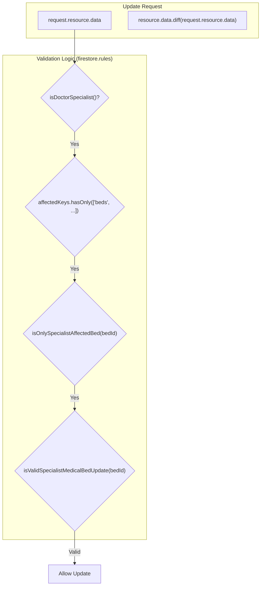

# Firestore Security Rules

# Firestore Security Rules

Relevant source files

The following files were used as context for generating this wiki page:

- [docs/FIRESTORE_RULES_COMPLEXITY_AUDIT.md](docs/FIRESTORE_RULES_COMPLEXITY_AUDIT.md)
- [docs/MAINTENANCE_ITERATION_LOG.md](docs/MAINTENANCE_ITERATION_LOG.md)
- [docs/OPERATIVE_RULES_REFERENCE.md](docs/OPERATIVE_RULES_REFERENCE.md)
- [docs/RUNBOOK_SECRET_ROTATION.md](docs/RUNBOOK_SECRET_ROTATION.md)
- [firestore.rules](firestore.rules)
- [functions/lib/prescriptionCleanupFunctions.js](functions/lib/prescriptionCleanupFunctions.js)
- [rules/README.md](rules/README.md)
- [rules/firestore/00-auth-and-role-helpers.rules](rules/firestore/00-auth-and-role-helpers.rules)
- [rules/firestore/30-daily-record-write-helpers.rules](rules/firestore/30-daily-record-write-helpers.rules)
- [rules/firestore/40-hospitals.rules](rules/firestore/40-hospitals.rules)
- [rules/firestore/50-global-rules.rules](rules/firestore/50-global-rules.rules)
- [rules/storage/10-storage-paths.rules](rules/storage/10-storage-paths.rules)
- [scripts/check-firestore-rules-governance.mjs](scripts/check-firestore-rules-governance.mjs)
- [scripts/config/firestore-rules-governance.json](scripts/config/firestore-rules-governance.json)
- [scripts/firestoreRulesCriticalAccessMatrixSupport.mjs](scripts/firestoreRulesCriticalAccessMatrixSupport.mjs)
- [scripts/firestoreRulesGovernanceSupport.mjs](scripts/firestoreRulesGovernanceSupport.mjs)
- [scripts/hook-hotspots-limits.json](scripts/hook-hotspots-limits.json)
- [scripts/maintenanceDebtScorecardSupport.mjs](scripts/maintenanceDebtScorecardSupport.mjs)
- [scripts/report-maintenance-debt-scorecard.mjs](scripts/report-maintenance-debt-scorecard.mjs)
- [scripts/rulesSourceSupport.mjs](scripts/rulesSourceSupport.mjs)
- [src/features/census/components/patient-row/PatientMainRowBedTypeCell.tsx](src/features/census/components/patient-row/PatientMainRowBedTypeCell.tsx)
- [src/features/census/components/patient-row/PatientSubRowView.tsx](src/features/census/components/patient-row/PatientSubRowView.tsx)
- [src/features/census/components/patient-row/useBedActiveTransferQuery.ts](src/features/census/components/patient-row/useBedActiveTransferQuery.ts)
- [src/features/census/controllers/patientRowBindingSectionsController.ts](src/features/census/controllers/patientRowBindingSectionsController.ts)
- [src/features/census/controllers/patientRowBindingsController.ts](src/features/census/controllers/patientRowBindingsController.ts)
- [src/features/census/controllers/patientRowViewContextController.ts](src/features/census/controllers/patientRowViewContextController.ts)
- [src/features/census/hooks/useCensusActionCommandsController.ts](src/features/census/hooks/useCensusActionCommandsController.ts)
- [src/features/handoff/components/HandoffRowCells.tsx](src/features/handoff/components/HandoffRowCells.tsx)
- [src/features/handoff/components/MedicalHandoffTabs.tsx](src/features/handoff/components/MedicalHandoffTabs.tsx)
- [src/features/handoff/controllers/handoffRowCellsController.ts](src/features/handoff/controllers/handoffRowCellsController.ts)
- [src/features/laboratory/controllers/labAnalyticsController.ts](src/features/laboratory/controllers/labAnalyticsController.ts)
- [src/features/prescriptions/index.ts](src/features/prescriptions/index.ts)
- [src/hooks/controllers/censusEmailRecipientRuntimeController.ts](src/hooks/controllers/censusEmailRecipientRuntimeController.ts)
- [src/hooks/useCensusEmailRecipientLists.ts](src/hooks/useCensusEmailRecipientLists.ts)
- [src/services/repositories/dailyRecordMasterSyncController.ts](src/services/repositories/dailyRecordMasterSyncController.ts)
- [src/services/repositories/dailyRecordWriteSupport.ts](src/services/repositories/dailyRecordWriteSupport.ts)
- [src/services/storage/indexeddb/indexedDbOpenHealthController.ts](src/services/storage/indexeddb/indexedDbOpenHealthController.ts)
- [src/tests/build/firestoreRulesGovernanceSupport.test.ts](src/tests/build/firestoreRulesGovernanceSupport.test.ts)
- [src/tests/build/maintenanceDebtScorecardSupport.test.ts](src/tests/build/maintenanceDebtScorecardSupport.test.ts)
- [src/tests/build/rulesSourceGovernance.test.ts](src/tests/build/rulesSourceGovernance.test.ts)
- [src/tests/build/rulesSourceSupport.test.ts](src/tests/build/rulesSourceSupport.test.ts)
- [src/tests/features/census/global-search/globalSearchContracts.test.ts](src/tests/features/census/global-search/globalSearchContracts.test.ts)
- [src/tests/functions/prescriptionCleanupFunctions.test.ts](src/tests/functions/prescriptionCleanupFunctions.test.ts)
- [src/tests/hooks/controllers/censusEmailRecipientRuntimeController.test.ts](src/tests/hooks/controllers/censusEmailRecipientRuntimeController.test.ts)
- [src/tests/security/firestore-rules.test.ts](src/tests/security/firestore-rules.test.ts)
- [src/tests/security/rulesHardeningStatic.test.ts](src/tests/security/rulesHardeningStatic.test.ts)
- [src/tests/services/repositories/dailyRecordMasterSyncController.test.ts](src/tests/services/repositories/dailyRecordMasterSyncController.test.ts)
- [src/tests/services/storage/indexedDbOpenHealthController.test.ts](src/tests/services/storage/indexedDbOpenHealthController.test.ts)
- [src/tests/views/census/CensusTableBody.test.tsx](src/tests/views/census/CensusTableBody.test.tsx)
- [src/tests/views/census/PatientMainRowBedTypeCell.test.tsx](src/tests/views/census/PatientMainRowBedTypeCell.test.tsx)
- [src/tests/views/census/PatientSubRowView.test.tsx](src/tests/views/census/PatientSubRowView.test.tsx)
- [src/tests/views/census/patientRowBindingsController.test.ts](src/tests/views/census/patientRowBindingsController.test.ts)
- [src/tests/views/census/patientRowViewContextController.test.ts](src/tests/views/census/patientRowViewContextController.test.ts)
- [src/tests/views/handoff/handoffRowCellsController.test.ts](src/tests/views/handoff/handoffRowCellsController.test.ts)

The Firestore security architecture in the HHR (Hospital Hanga Roa) system is designed around a strict Role-Based Access Control (RBAC) model, clinical time-windows, and payload-level validation. Due to the complexity of clinical data, the system employs an optimized ruleset that balances granular security with the Firestore 1,000-expression evaluation limit.

## Security Architecture Overview

The security system transitions from identity verification to role resolution, finally reaching domain-specific validation logic.

### Role Resolution Flow

Roles are resolved via `getEffectiveRole()`, which implements a tiered lookup:

1.  **Configured Role**: A lookup in the `/config/roles` document using the user's normalized email [firestore.rules:21-26]().
2.  **Custom Claims**: A fallback to the `role` claim in the Firebase Auth token [firestore.rules:27-33]().

The system normalizes legacy roles (e.g., `viewer_census` to `viewer`) to ensure backward compatibility [firestore.rules:16-20]().

### Diagram: Role Resolution and Access Flow

Sources: [firestore.rules:1-66]()

---

## Core Security Functions

### Effective Role Management

The system uses `hasAnyEffectiveRole` to check if the current user possesses any of the required permissions for an operation. This is the primary gate for clinical data access [firestore.rules:43-48]().

### DailyRecord Update Governance

The `canUpdatePersistedDailyRecord` function is the most critical gate in the system. It enforces:

- **Role Check**: Ensures the user has `canEdit()` permissions or is a specialist [firestore.rules:64-66]().
- **Persistence Check**: Uses `exists()` to ensure updates only happen on existing documents, preventing accidental creation via update [docs/FIRESTORE_RULES_COMPLEXITY_AUDIT.md:66-67]().
- **Time Window**: (Implemented in clinical logic) limits editing of historical records [docs/OPERATIVE_RULES_REFERENCE.md:22-22]().

### Specialist Payload Segmentation

To allow specialists (e.g., Surgeons, Pediatricians) to update only their specific handoff data without full edit permissions, the rules implement `isAnySpecialistAffectedBed` [firestore.rules:112-136]().

- **Affected Keys**: Validation ensures specialists only touch `medicalHandoffEntries`, `medicalHandoffNote`, and `clinicalEvents` [firestore.rules:73-81]().
- **Bed Isolation**: The rule `isOnlySpecialistAffectedBed` restricts updates to exactly one bed at a time to prevent bulk unauthorized changes [firestore.rules:107-111]().

Sources: [firestore.rules:73-136](), [docs/FIRESTORE_RULES_COMPLEXITY_AUDIT.md:79-87]()

---

## Expression Limit Optimization (Iteration Blocks)

The codebase underwent a "Complexity Audit" to address the Firestore emulator's 1,000-expression limit. High-fan-in functions were refactored into "Iteration Blocks" to reduce evaluation cost.

| Iteration  | Focus             | Impact                                                                                                                                  |
| :--------- | :---------------- | :-------------------------------------------------------------------------------------------------------------------------------------- |
| **Iter 1** | Role Resolution   | Consolidated `isAdmin/isNurse` to avoid cascading lookups [docs/FIRESTORE_RULES_COMPLEXITY_AUDIT.md:40-50]().                           |
| **Iter 2** | Persistence Guard | Added `hasPersistedDailyRecord()` to cut evaluation early on missing docs [docs/FIRESTORE_RULES_COMPLEXITY_AUDIT.md:62-70]().           |
| **Iter 3** | Role Segmentation | Rewrote `dailyRecords.update` to branch by role early in the logic [docs/FIRESTORE_RULES_COMPLEXITY_AUDIT.md:79-87]().                  |
| **Iter 5** | Specialist Path   | Refactored `isOnlySpecialistAffectedBed` to avoid deep diffs on non-affected beds [docs/FIRESTORE_RULES_COMPLEXITY_AUDIT.md:123-132](). |

Sources: [docs/FIRESTORE_RULES_COMPLEXITY_AUDIT.md:1-135]()

---

## Payload Segmentation and Collection Mapping

The system segments permissions by collection to maintain the principle of least privilege.

### Collection Access Matrix

| Collection      | Read Permission         | Write Permission             | Logic                                                                                                                 |
| :-------------- | :---------------------- | :--------------------------- | :-------------------------------------------------------------------------------------------------------------------- |
| `dailyRecords`  | `canReadClinicalData()` | `canEdit()` / Specialist     | Primary clinical state [rules/firestore/40-hospitals.rules:5-10]().                                                   |
| `prescriptions` | `canReadClinicalData()` | `canEdit()`                  | Clients cannot `create` directly; must use Cloud Functions [src/tests/security/rulesHardeningStatic.test.ts:94-99](). |
| `auditLogs`     | Admin Only              | Append-Only                  | Users can create but never update/delete [rules/firestore/40-hospitals.rules:65-70]().                                |
| `systemHealth`  | `canEdit()`             | `isValidSystemHealthWrite()` | Payload validation for telemetry [firestore.rules:67-69]().                                                           |

### Diagram: Specialist Write Path Validation

Sources: [firestore.rules:83-111](), [rules/firestore/40-hospitals.rules:53-58]()

---

## Rules Governance System

The `firestore.rules` file is an **artifact generated from fragments** located in `rules/firestore/*.rules` [docs/OPERATIVE_RULES_REFERENCE.md:112-113]().

- **Fragment Management**: Logic is split into functional areas: `00-auth-and-role-helpers.rules`, `30-daily-record-write-helpers.rules`, and `40-hospitals.rules`.
- **Governance Config**: Every fragment must be registered in `scripts/config/firestore-rules-governance.json` with an assigned owner and risk level [docs/OPERATIVE_RULES_REFERENCE.md:114-115]().
- **Static Hardening**: Vitest suites in `src/tests/security/rulesHardeningStatic.test.ts` ensure that:
  - No sensitive collections are publicly readable [src/tests/security/rulesHardeningStatic.test.ts:11-18]().
  - `delete` operations are restricted to `admin` [src/tests/security/rulesHardeningStatic.test.ts:47-58]().
  - Bootstrap admin emails are not hardcoded in the final rules [src/tests/security/rulesHardeningStatic.test.ts:66-91]().

Sources: [docs/OPERATIVE_RULES_REFERENCE.md:111-116](), [src/tests/security/rulesHardeningStatic.test.ts:1-132]()

---
