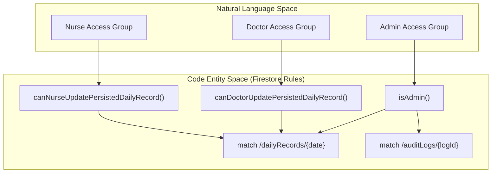
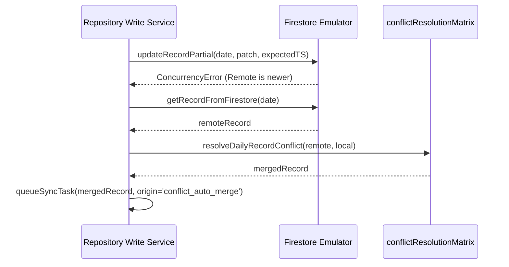

# Security Testing & Access Groups

# Security Testing & Access Groups

Relevant source files

The following files were used as context for generating this wiki page:

- [docs/RUNBOOK_SECRET_ROTATION.md](docs/RUNBOOK_SECRET_ROTATION.md)
- [functions/lib/prescriptionCleanupFunctions.js](functions/lib/prescriptionCleanupFunctions.js)
- [rules/README.md](rules/README.md)
- [rules/firestore/00-auth-and-role-helpers.rules](rules/firestore/00-auth-and-role-helpers.rules)
- [rules/firestore/30-daily-record-write-helpers.rules](rules/firestore/30-daily-record-write-helpers.rules)
- [rules/firestore/40-hospitals.rules](rules/firestore/40-hospitals.rules)
- [rules/firestore/50-global-rules.rules](rules/firestore/50-global-rules.rules)
- [rules/storage/10-storage-paths.rules](rules/storage/10-storage-paths.rules)
- [scripts/check-firestore-rules-governance.mjs](scripts/check-firestore-rules-governance.mjs)
- [scripts/check-rules-source-governance.mjs](scripts/check-rules-source-governance.mjs)
- [scripts/config/firestore-rules-governance.json](scripts/config/firestore-rules-governance.json)
- [scripts/firestoreRulesCriticalAccessMatrixSupport.mjs](scripts/firestoreRulesCriticalAccessMatrixSupport.mjs)
- [scripts/firestoreRulesGovernanceSupport.mjs](scripts/firestoreRulesGovernanceSupport.mjs)
- [scripts/hook-hotspots-limits.json](scripts/hook-hotspots-limits.json)
- [scripts/maintenanceDebtScorecardSupport.mjs](scripts/maintenanceDebtScorecardSupport.mjs)
- [scripts/report-maintenance-debt-scorecard.mjs](scripts/report-maintenance-debt-scorecard.mjs)
- [scripts/rulesSourceGovernanceSupport.mjs](scripts/rulesSourceGovernanceSupport.mjs)
- [scripts/rulesSourceSupport.mjs](scripts/rulesSourceSupport.mjs)
- [src/features/prescriptions/index.ts](src/features/prescriptions/index.ts)
- [src/services/repositories/conflictResolutionDeviceMergeUtils.ts](src/services/repositories/conflictResolutionDeviceMergeUtils.ts)
- [src/services/repositories/conflictResolutionMatrix.ts](src/services/repositories/conflictResolutionMatrix.ts)
- [src/services/repositories/conflictResolutionMergeUtils.ts](src/services/repositories/conflictResolutionMergeUtils.ts)
- [src/services/repositories/conflictResolutionPolicy.ts](src/services/repositories/conflictResolutionPolicy.ts)
- [src/services/repositories/conflictResolutionStaffingMergeUtils.ts](src/services/repositories/conflictResolutionStaffingMergeUtils.ts)
- [src/services/repositories/conflictResolutionTrace.ts](src/services/repositories/conflictResolutionTrace.ts)
- [src/services/storage/indexeddb/indexedDbOpenHealthController.ts](src/services/storage/indexeddb/indexedDbOpenHealthController.ts)
- [src/tests/build/firestoreRulesGovernanceSupport.test.ts](src/tests/build/firestoreRulesGovernanceSupport.test.ts)
- [src/tests/build/maintenanceDebtScorecardSupport.test.ts](src/tests/build/maintenanceDebtScorecardSupport.test.ts)
- [src/tests/build/rulesSourceGovernance.test.ts](src/tests/build/rulesSourceGovernance.test.ts)
- [src/tests/build/rulesSourceSupport.test.ts](src/tests/build/rulesSourceSupport.test.ts)
- [src/tests/emulator/sync-concurrency.emulator.test.ts](src/tests/emulator/sync-concurrency.emulator.test.ts)
- [src/tests/functions/prescriptionCleanupFunctions.test.ts](src/tests/functions/prescriptionCleanupFunctions.test.ts)
- [src/tests/security/firestoreRulesAccessGroups.ts](src/tests/security/firestoreRulesAccessGroups.ts)
- [src/tests/security/firestoreRulesEmulatorConfig.test.ts](src/tests/security/firestoreRulesEmulatorConfig.test.ts)
- [src/tests/security/firestoreRulesEmulatorConfig.ts](src/tests/security/firestoreRulesEmulatorConfig.ts)
- [src/tests/security/firestoreRulesTestHarness.ts](src/tests/security/firestoreRulesTestHarness.ts)
- [src/tests/security/rulesHardeningStatic.test.ts](src/tests/security/rulesHardeningStatic.test.ts)
- [src/tests/services/repositories/conflictResolutionMatrix.test.ts](src/tests/services/repositories/conflictResolutionMatrix.test.ts)
- [src/tests/services/repositories/dailyRecordRepositoryWriteServiceAutoMerge.test.ts](src/tests/services/repositories/dailyRecordRepositoryWriteServiceAutoMerge.test.ts)
- [src/tests/services/storage/indexedDbOpenHealthController.test.ts](src/tests/services/storage/indexedDbOpenHealthController.test.ts)

The security architecture of the HHR system is validated through a multi-layered testing strategy that combines live Firestore emulator integration tests, concurrency simulations, and static analysis of security rules. This ensures that the Role-Based Access Control (RBAC) and clinical data partitions are strictly enforced across different professional groups (nurses, doctors, and specialists).

## Access Group Partitions

The system partitions access based on the user's effective role, which is resolved via Firestore security rules and validated against a central role configuration.

### Professional Access Matrix

Access is governed by specific conditions defined in the rules fragments:

- **Nurses (`nurse_hospital`)**: Can update full daily records (census, staffing, movements) within a specific temporal window (typically -24h to +48h from the record date) [rules/firestore/30-daily-record-write-helpers.rules:34-37]().
- **Doctors (`doctor_urgency`)**: Restricted to medical signature fields and handoff metadata. They cannot modify nursing staffing or census bed details [rules/firestore/30-daily-record-write-helpers.rules:39-41]().
- **Specialists (`doctor_specialist`)**: Restricted to their specific specialty handoff payload [rules/firestore/30-daily-record-write-helpers.rules:43-45]().
- **Admins**: Full read/write access to all collections, including the ability to delete records which is otherwise forbidden [rules/firestore/40-hospitals.rules:9-10]().

### Code-to-Rules Mapping

The following diagram maps the logical access groups to the specific rule functions and collection matches.

**Logical Access to Code Entity Mapping**

Sources: [rules/firestore/30-daily-record-write-helpers.rules:34-67](), [rules/firestore/40-hospitals.rules:5-10](), [rules/firestore/40-hospitals.rules:65-70]().

## Security Test Harness

The `FirestoreRulesHarness` provides a standardized environment for executing security tests against the Firebase Emulator. It simulates different authentication contexts and timestamps to verify window-based permissions.

### Access Group Validation

The `registerFirestoreRulesAccessGroups` function executes a suite of tests that verify:

1.  **Append-Only Logs**: Ensuring `auditLogs` can be created by any authenticated user but never updated or deleted, even by admins [src/tests/security/firestoreRulesAccessGroups.ts:58-69]().
2.  **Temporal Windows**: Validating that nurses can only edit records within the allowed timeframe [src/tests/security/firestoreRulesAccessGroups.ts:94-105]().
3.  **Role Isolation**: Confirming that unauthenticated or unauthorized users are rejected from clinical collections [src/tests/security/firestoreRulesAccessGroups.ts:80-83]().

Sources: [src/tests/security/firestoreRulesAccessGroups.ts:1-105](), [src/tests/security/firestoreRulesTestHarness.ts:1-20]().

## Sync Concurrency & Emulator Testing

The system employs an emulator-based test suite to verify the `LWW` (Last-Write-Wins) and conflict resolution logic under concurrent write conditions.

### Concurrency Error Handling

The `sync-concurrency.emulator.test.ts` validates that the `saveRecordToFirestore` function correctly throws a `ConcurrencyError` if the local `expectedLastUpdated` timestamp is older than the remote version [src/tests/emulator/sync-concurrency.emulator.test.ts:148-165]().

### Auto-Merge Pipeline

When a concurrency conflict is detected, the `dailyRecordRepositoryWriteService` triggers an automatic merge using the `conflictResolutionMatrix`. This ensures that local changes (like a patient's pathology) are preserved without overwriting remote changes (like a new discharge) [src/tests/services/repositories/dailyRecordRepositoryWriteServiceAutoMerge.test.ts:105-133]().

**Concurrency Data Flow**

Sources: [src/tests/emulator/sync-concurrency.emulator.test.ts:148-172](), [src/tests/services/repositories/dailyRecordRepositoryWriteServiceAutoMerge.test.ts:105-146]().

## Static Security Tests

Static analysis guards prevent security regressions during build time without requiring the full emulator environment.

### Governance Guards

- **Daily Record Root Import Governance**: Ensures that sensitive operations on `dailyRecords` are restricted to the `isAdmin` rule and not exposed to general nursing roles [src/tests/security/rulesHardeningStatic.test.ts:47-58]().
- **Legacy Role Alias Static**: Verifies that deprecated roles like `isGeneralViewer` have been removed from the rules source [src/tests/security/rulesHardeningStatic.test.ts:60-64]().
- **Prescription Constants Drift**: A critical guard `findCriticalAccessMatrixDrift` compares the live `firestore.rules` against a hardcoded `CRITICAL_FIRESTORE_ACCESS_MATRIX` to detect any accidental relaxation of permissions [scripts/firestoreRulesCriticalAccessMatrixSupport.mjs:181-205]().

### Prescription Module Security

Static tests confirm that prescriptions follow a strict security model:

1.  **No Direct Client Creation**: Clients cannot create documents in the `prescriptions` collection directly; they must use a Cloud Function [src/tests/security/rulesHardeningStatic.test.ts:94-99]().
2.  **Access Pin Protection**: The `config/prescriptionsAccess` document is strictly `read: if isAdmin()` and never writable by clients [src/tests/security/rulesHardeningStatic.test.ts:114-120]().

Sources: [src/tests/security/rulesHardeningStatic.test.ts:1-132](), [scripts/firestoreRulesCriticalAccessMatrixSupport.mjs:1-90]().

---
