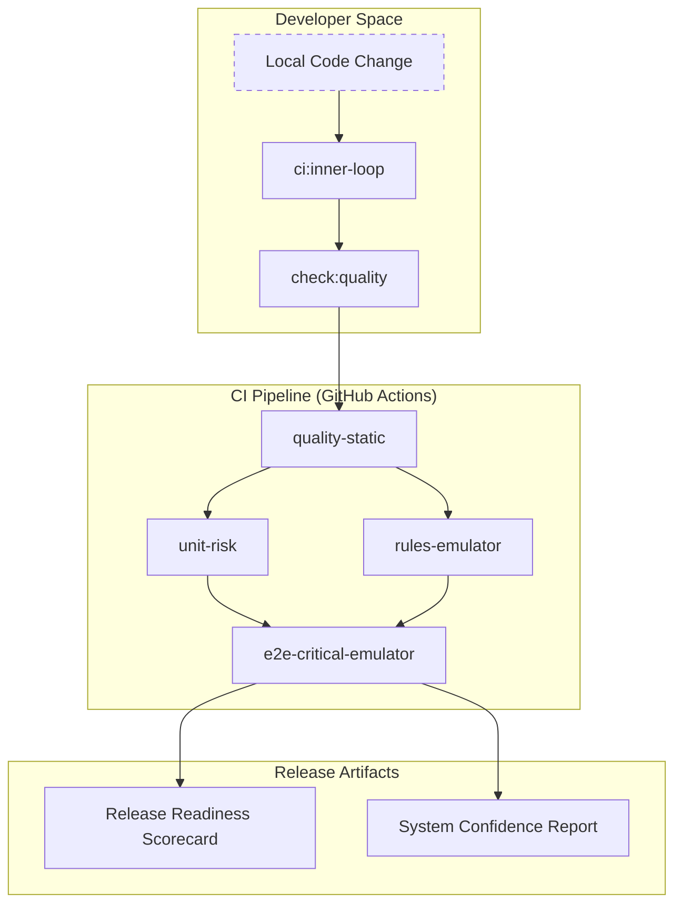
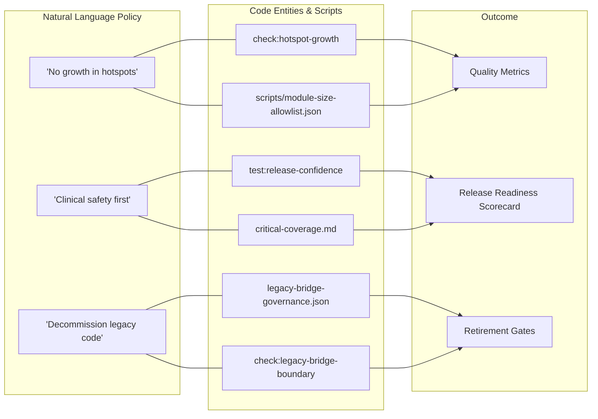

# Quality Guardrails & CI/CD

# Quality Guardrails & CI/CD

Relevant source files

The following files were used as context for generating this wiki page:

- [.github/workflows/ci-cd.yml](.github/workflows/ci-cd.yml)
- [ARCHITECTURE.md](ARCHITECTURE.md)
- [README.md](README.md)
- [docs/CI_GATES_AND_FAILURE_RUNBOOKS.md](docs/CI_GATES_AND_FAILURE_RUNBOOKS.md)
- [docs/DEVELOPER_COMMANDS.md](docs/DEVELOPER_COMMANDS.md)
- [docs/FOUNDATION_TRACKER.md](docs/FOUNDATION_TRACKER.md)
- [docs/QUALITY_GUARDRAILS.md](docs/QUALITY_GUARDRAILS.md)
- [docs/TEST_MEGATEST_BACKLOG.md](docs/TEST_MEGATEST_BACKLOG.md)
- [e2e/census-preview-bootstrap.spec.ts](e2e/census-preview-bootstrap.spec.ts)
- [functions/index.js](functions/index.js)
- [package.json](package.json)
- [playwright.emulator-critical.config.ts](playwright.emulator-critical.config.ts)
- [public/version.json](public/version.json)
- [reports/legacy-bridge-governance.json](reports/legacy-bridge-governance.json)
- [reports/legacy-bridge-governance.md](reports/legacy-bridge-governance.md)
- [reports/runtime-contracts.json](reports/runtime-contracts.json)
- [reports/runtime-contracts.md](reports/runtime-contracts.md)
- [scripts/check-core-trivial-tests.mjs](scripts/check-core-trivial-tests.mjs)
- [scripts/check-feature-public-api-boundary.mjs](scripts/check-feature-public-api-boundary.mjs)
- [scripts/check-quality-aggregate.mjs](scripts/check-quality-aggregate.mjs)
- [scripts/check-release-evidence.mjs](scripts/check-release-evidence.mjs)
- [scripts/check-technical-ownership-map.mjs](scripts/check-technical-ownership-map.mjs)
- [scripts/config/guardrail-governance.json](scripts/config/guardrail-governance.json)
- [scripts/config/release-confidence-matrix.json](scripts/config/release-confidence-matrix.json)
- [scripts/config/technical-ownership-map.json](scripts/config/technical-ownership-map.json)
- [scripts/feature-public-api-allowlist.json](scripts/feature-public-api-allowlist.json)
- [scripts/releaseConfidenceMatrixSupport.mjs](scripts/releaseConfidenceMatrixSupport.mjs)
- [scripts/releaseReadinessScorecardSupport.mjs](scripts/releaseReadinessScorecardSupport.mjs)
- [scripts/report-quality-metrics.mjs](scripts/report-quality-metrics.mjs)
- [scripts/report-release-readiness-scorecard.mjs](scripts/report-release-readiness-scorecard.mjs)
- [scripts/report-system-confidence.mjs](scripts/report-system-confidence.mjs)
- [src/tests/app-shell/bootstrapRuntimeTelemetry.test.ts](src/tests/app-shell/bootstrapRuntimeTelemetry.test.ts)
- [src/tests/build/releaseConfidenceMatrixSupport.test.ts](src/tests/build/releaseConfidenceMatrixSupport.test.ts)
- [src/tests/build/releaseEvidence.test.ts](src/tests/build/releaseEvidence.test.ts)
- [src/tests/build/releaseReadinessScorecardSupport.test.ts](src/tests/build/releaseReadinessScorecardSupport.test.ts)
- [src/tests/components/BookmarkEditorModal.test.tsx](src/tests/components/BookmarkEditorModal.test.tsx)
- [src/tests/components/useAppContentShellEffects.test.tsx](src/tests/components/useAppContentShellEffects.test.tsx)
- [src/tests/components/useBookmarkImport.test.ts](src/tests/components/useBookmarkImport.test.ts)
- [src/tests/features/whatsapp/StaffCard.test.tsx](src/tests/features/whatsapp/StaffCard.test.tsx)
- [src/tests/services/repositories/DailyRecordRepository.persistence-and-copy.test.ts](src/tests/services/repositories/DailyRecordRepository.persistence-and-copy.test.ts)

The HHR system employs a multi-tiered quality enforcement architecture designed to prevent structural debt and ensure clinical safety. This system transitions from high-frequency developer feedback (Inner Loop) to rigorous, blocking validation gates (Release Gate). The strategy combines static analysis, architectural boundary enforcement, and automated release readiness scoring.

## CI/CD Pipeline & Tiered Gates

The project uses a structured CI/CD pipeline defined in [.github/workflows/ci-cd.yml:1-194](). This pipeline is orchestrated through a set of "Gates" that increase in depth as a change moves toward production.

| Gate             | Purpose                                                          | Key Commands              |
| :--------------- | :--------------------------------------------------------------- | :------------------------ |
| **Inner Loop**   | Fast local feedback on types, linting, and critical unit tests.  | `npm run ci:inner-loop`   |
| **Pre-Merge**    | Mandatory verification for Pull Requests.                        | `npm run ci:pre-merge`    |
| **Merge Gate**   | Extended validation for clinical code, auth, and bundle budgets. | `npm run ci:merge-gate`   |
| **Release Gate** | Final validation with Firestore emulators and E2E smoke tests.   | `npm run ci:release-gate` |

The governance of these tiers is centralized in `scripts/config/guardrail-governance.json` [scripts/config/guardrail-governance.json:3-55](), which maps scripts to specific quality levels.

For details on the specific checks performed in each tier, see **[CI Gates & Quality Checks](#15.1)**.

### CI Workflow Architecture

The following diagram illustrates how the CI pipeline bridges the gap between local development scripts and the final release artifacts.

**Sources:** [.github/workflows/ci-cd.yml:10-240](), [scripts/config/guardrail-governance.json:1-134]().

## Quality Enforcement (Guardrails)

Quality is maintained through an aggregate of over 50 specialized checks managed by `check-quality-aggregate.mjs` [scripts/config/guardrail-governance.json:135-180](). These guardrails enforce:

- **Architectural Boundaries:** Ensuring features do not leak internals (e.g., `check:feature-public-api-boundary`) [scripts/config/guardrail-governance.json:148]().
- **Module Size Limits:** Preventing the growth of "hotspot" files via `check:module-size` and `check:hotspot-growth` [scripts/config/guardrail-governance.json:169-174]().
- **Security & Governance:** Validating Firestore rules, schema evolution, and runtime contracts [scripts/config/guardrail-governance.json:161-164]().

For details on boundary enforcement and the technical ownership map, see **[CI Gates & Quality Checks](#15.1)**.

## Release Readiness & Evidence

Before a release is authorized, the system generates a **Release Readiness Scorecard**. This is an executive summary that aggregates technical metrics into a go/no-go indicator.

- **System Confidence:** Derived from test coverage, sync resilience, and operational health [scripts/config/guardrail-governance.json:80-83]().
- **Legacy Bridge Governance:** Tracks the status of transitional code (observe/restrict/retire_ready) to ensure legacy paths are eventually decommissioned [reports/legacy-bridge-governance.json:16-20]().
- **Evidence Requirements:** Requires fresh snapshots of governance reports and E2E visual release reports [docs/QUALITY_GUARDRAILS.md:93-94]().

For details on the scorecard generation and confidence metrics, see **[Release Evidence & Scorecard](#15.2)**.

### Governance Entity Mapping

This diagram maps high-level governance concepts to the specific code entities and reports that enforce them.

**Sources:** [docs/QUALITY_GUARDRAILS.md:18-31](), [reports/legacy-bridge-governance.json:21-42](), [scripts/config/guardrail-governance.json:173-174]().

## Testing Strategy

The system utilizes a "Confidence Pack" strategy, focusing on high-value tests rather than 100% coverage.

- **Critical Smoke Pack:** Fast runtime checks for essential clinical flows [package.json:29]().
- **Firestore Emulator:** Mandatory for testing sync conflict resolution and security rules [package.json:182-193]().
- **E2E Playwright:** Validates the entire stack, including performance budgets for startup and clinical interactions [package.json:41-44]().

For details on the testing layers and visual regression testing (VRT), see **[Testing Strategy & E2E](#15.3)**.

## Key Configuration Files

| File                           | Role                                                                                                     |
| :----------------------------- | :------------------------------------------------------------------------------------------------------- |
| `package.json`                 | Entry point for all CI/CD scripts [package.json:9-117]().                                                |
| `guardrail-governance.json`    | Defines which checks are blocking vs. report-only [scripts/config/guardrail-governance.json:1-134]().    |
| `technical-ownership-map.json` | Maps critical subsystems to technical owners and runbooks [docs/CI_GATES_AND_FAILURE_RUNBOOKS.md:113](). |
| `runtime-contracts.json`       | Versioning for client/backend compatibility [reports/runtime-contracts.json:1-19]().                     |

**Sources:**

- [package.json:9-117]()
- [scripts/config/guardrail-governance.json:1-134]()
- [docs/QUALITY_GUARDRAILS.md:1-94]()
- [docs/CI_GATES_AND_FAILURE_RUNBOOKS.md:1-166]()
- [reports/legacy-bridge-governance.json:1-55]()
- [reports/runtime-contracts.json:1-19]()

---
