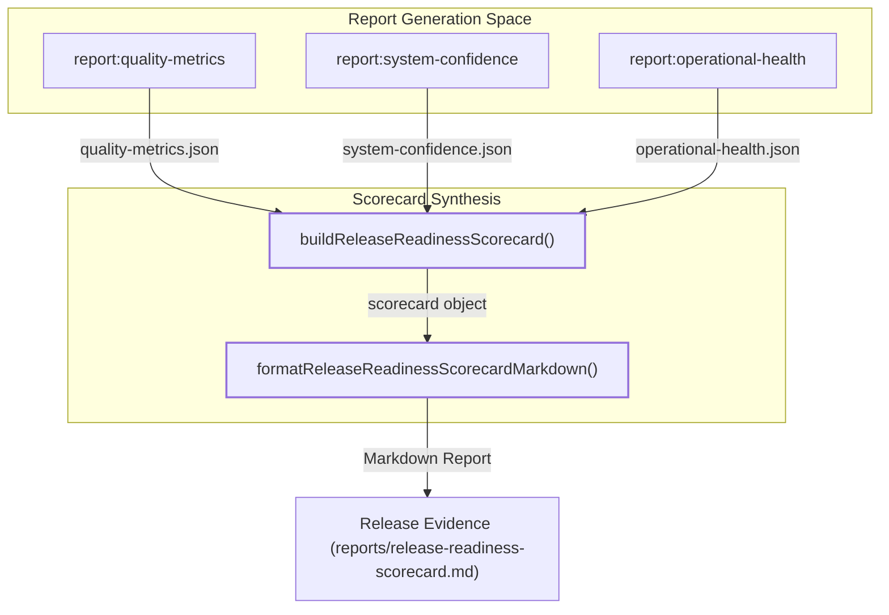
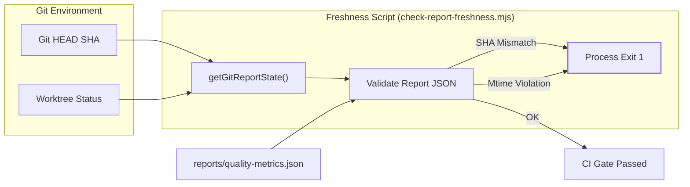

# Release Evidence & Scorecard

# Release Evidence & Scorecard

Relevant source files

The following files were used as context for generating this wiki page:

- [docs/FOUNDATION_TRACKER.md](docs/FOUNDATION_TRACKER.md)
- [docs/TEST_MEGATEST_BACKLOG.md](docs/TEST_MEGATEST_BACKLOG.md)
- [docs/superpowers/plans/2026-04-19-reduccion-segura-deuda-muerta-v2.md](docs/superpowers/plans/2026-04-19-reduccion-segura-deuda-muerta-v2.md)
- [docs/superpowers/plans/2026-04-19-reduccion-segura-deuda-muerta-v3.md](docs/superpowers/plans/2026-04-19-reduccion-segura-deuda-muerta-v3.md)
- [docs/superpowers/plans/2026-04-19-reduccion-segura-deuda-muerta.md](docs/superpowers/plans/2026-04-19-reduccion-segura-deuda-muerta.md)
- [docs/superpowers/plans/2026-04-19-retirar-censusEmailRecipientsController.md](docs/superpowers/plans/2026-04-19-retirar-censusEmailRecipientsController.md)
- [docs/superpowers/plans/cleanup-inventory-2026-04-19.md](docs/superpowers/plans/cleanup-inventory-2026-04-19.md)
- [e2e/census-preview-bootstrap.spec.ts](e2e/census-preview-bootstrap.spec.ts)
- [reports/legacy-bridge-governance.json](reports/legacy-bridge-governance.json)
- [reports/legacy-bridge-governance.md](reports/legacy-bridge-governance.md)
- [reports/runtime-contracts.json](reports/runtime-contracts.json)
- [reports/runtime-contracts.md](reports/runtime-contracts.md)
- [scripts/check-core-trivial-tests.mjs](scripts/check-core-trivial-tests.mjs)
- [scripts/check-report-freshness.mjs](scripts/check-report-freshness.mjs)
- [scripts/config/release-confidence-matrix.json](scripts/config/release-confidence-matrix.json)
- [scripts/gitReportState.mjs](scripts/gitReportState.mjs)
- [scripts/releaseReadinessScorecardSupport.mjs](scripts/releaseReadinessScorecardSupport.mjs)
- [scripts/report-quality-metrics.mjs](scripts/report-quality-metrics.mjs)
- [scripts/report-release-readiness-scorecard.mjs](scripts/report-release-readiness-scorecard.mjs)
- [scripts/report-system-confidence.mjs](scripts/report-system-confidence.mjs)
- [src/tests/app-shell/bootstrapRuntimeTelemetry.test.ts](src/tests/app-shell/bootstrapRuntimeTelemetry.test.ts)
- [src/tests/build/gitReportState.test.ts](src/tests/build/gitReportState.test.ts)
- [src/tests/build/releaseReadinessScorecardSupport.test.ts](src/tests/build/releaseReadinessScorecardSupport.test.ts)
- [src/tests/build/reportFreshness.test.ts](src/tests/build/reportFreshness.test.ts)
- [src/tests/components/BookmarkEditorModal.test.tsx](src/tests/components/BookmarkEditorModal.test.tsx)
- [src/tests/components/useAppContentShellEffects.test.tsx](src/tests/components/useAppContentShellEffects.test.tsx)
- [src/tests/components/useBookmarkImport.test.ts](src/tests/components/useBookmarkImport.test.ts)
- [src/tests/features/whatsapp/StaffCard.test.tsx](src/tests/features/whatsapp/StaffCard.test.tsx)
- [src/tests/services/repositories/DailyRecordRepository.persistence-and-copy.test.ts](src/tests/services/repositories/DailyRecordRepository.persistence-and-copy.test.ts)

The **Release Readiness Scorecard** is the final automated quality gate in the HHR (Hospital Hanga Roa) deployment pipeline. It aggregates metrics from structural quality, system confidence, operational health, and governance snapshots into a single, high-visibility report used to determine if a build is fit for production.

## Scorecard Architecture

The scorecard system operates by collecting JSON artifacts produced by various sub-reporting scripts and synthesizing them into a unified readiness state. This process is orchestrated by `scripts/releaseReadinessScorecardSupport.mjs`.

### Data Flow & Aggregation

The scorecard consumes reports from the `reports/` directory, including:

- `quality-metrics.json`: Structural health (module sizes, dependency debt) [scripts/releaseReadinessScorecardSupport.mjs:141]().
- `system-confidence.json`: Test governance and known failure tracking [scripts/releaseReadinessScorecardSupport.mjs:142]().
- `operational-health.json`: Runtime performance and startup telemetry [scripts/releaseReadinessScorecardSupport.mjs:143]().
- `compatibility-import-governance.json`: Enforcement of boundary rules between features [scripts/releaseReadinessScorecardSupport.mjs:147]().

### Scorecard Aggregation Logic

The function `buildReleaseReadinessScorecard` maps these reports into specific **Readiness Indicators** [scripts/releaseReadinessScorecardSupport.mjs:139-157]().

| Indicator                  | Source                                 | OK Criteria                                                                                                |
| :------------------------- | :------------------------------------- | :--------------------------------------------------------------------------------------------------------- |
| `structural_quality`       | `quality-metrics.json`                 | 0 oversized modules, 0 dependency violations [scripts/releaseReadinessScorecardSupport.mjs:161-164]().     |
| `system_confidence`        | `system-confidence.json`               | Overall status "ok" and 0 open known failures [scripts/releaseReadinessScorecardSupport.mjs:178-180]().    |
| `frontend_startup`         | `operational-health.json`              | Preview gate status "ok" and 0 startup issues [scripts/releaseReadinessScorecardSupport.mjs:201-207]().    |
| `compatibility_governance` | `compatibility-import-governance.json` | 0 unauthorized imports across feature boundaries [scripts/releaseReadinessScorecardSupport.mjs:223-228](). |

**Release Evidence Entity Map**

Sources: [scripts/releaseReadinessScorecardSupport.mjs:139-250](), [scripts/report-system-confidence.mjs:39-95]()

## Operational Health & Bundle Budgets

A critical component of the scorecard is the **Release Hotspots** section, which monitors the production bundle size against defined budgets.

### Bundle Budget Checks

The script `readBuildAssetsFromDist` inspects the `dist/assets` directory and compares file sizes against `scripts/config/bundle-budget.json` [scripts/releaseReadinessScorecardSupport.mjs:26-33]().

- **Global Chunk Limit**: Default maximum size for any JS chunk [scripts/releaseReadinessScorecardSupport.mjs:33]().
- **Startup Budgets**: Strict limits for entrypoint chunks (e.g., `index.js`) to ensure fast TTI [scripts/releaseReadinessScorecardSupport.mjs:54-60]().
- **Severity Levels**: Assets can be flagged as `warn` or `error` depending on the budget configuration [scripts/releaseReadinessScorecardSupport.mjs:83-88]().

### Hotspot Reporting

The top 5 largest assets are always included in the scorecard summary to provide visibility into "bundle bloat" [scripts/releaseReadinessScorecardSupport.mjs:126-136]().

Sources: [scripts/releaseReadinessScorecardSupport.mjs:26-97](), [scripts/releaseReadinessScorecardSupport.mjs:122-137]()

## Legacy Bridge Governance

The system maintains a **Legacy Bridge** to support data migration and compatibility with older Firestore schemas. This bridge is governed by a strict lifecycle to prevent "permanent temporary" code.

### Governance Lifecycle

The bridge transitions through three phases defined in `reports/legacy-bridge-governance.json`:

1.  **Observe**: Active usage is monitored; hot path isolation may be incomplete [reports/legacy-bridge-governance.json:17]().
2.  **Restrict**: Default stage; usage is explicit-only and audited [reports/legacy-bridge-governance.json:18]().
3.  **Retire Ready**: Bridge is disabled in runtime; awaiting final removal after a clear release window [reports/legacy-bridge-governance.json:19]().

### Retirement Gates

Before a bridge can be retired, it must pass several gates:

- **Hot path isolation**: Compatibility logic must reside outside the main read/write loops [reports/legacy-bridge-governance.json:23-26]().
- **Release window clear**: No bridge dependency recorded in production for at least one release cycle [reports/legacy-bridge-governance.json:38-41]().

Sources: [reports/legacy-bridge-governance.json:1-54](), [reports/legacy-bridge-governance.md:1-44]()

## Runtime Contracts

The system tracks **Runtime Contract Versions** to ensure compatibility between the frontend client and the Firebase Cloud Functions (Backend).

### Contract Manifest

The `reports/runtime-contracts.json` file defines the minimum supported versions:

- `clientRuntimeContractVersion`: The current version of the UI [reports/runtime-contracts.json:3]().
- `backendRuntimeContractVersion`: The current version of the cloud functions [reports/runtime-contracts.json:4]().
- `currentSchemaVersion`: The version of the `DailyRecord` data structure [reports/runtime-contracts.json:7]().

This manifest allows the `BootstrapRouteChrome` to block users if their client version is lower than the `minSupportedClientRuntimeContractVersion` [reports/runtime-contracts.json:6]().

Sources: [reports/runtime-contracts.json:1-18](), [reports/runtime-contracts.md:1-19]()

## Report Freshness & Git State

To prevent the scorecard from using stale data, the CI pipeline runs `check-report-freshness.mjs`.

### Freshness Validation Logic

The script ensures that all reports in the `reports/` directory match the current repository state:

1.  **SHA Matching**: The `gitSha` recorded inside the JSON report must match the current `HEAD` or a direct merge parent [scripts/check-report-freshness.mjs:72-80]().
2.  **Worktree Integrity**: If the report was generated with a "dirty" worktree, it must match the current worktree state [scripts/check-report-freshness.mjs:114-121]().
3.  **Dependency Chain**: If `operational-health.json` is newer than `system-confidence.json`, the latter is considered stale because it depends on the former [scripts/check-report-freshness.mjs:124-134]().

### Git State Tracking

The `gitReportState.mjs` utility provides a consistent way to determine if a worktree is "meaningfully" dirty. It ignores changes to the reports themselves (since generating a report shouldn't make the report stale) using the `GENERATED_REPORT_STATUS_SUFFIXES` allowlist [scripts/gitReportState.mjs:11-16]().

**Freshness & Git State Workflow**

Sources: [scripts/check-report-freshness.mjs:1-66](), [scripts/gitReportState.mjs:5-16](), [scripts/gitReportState.mjs:75-78]()

---
