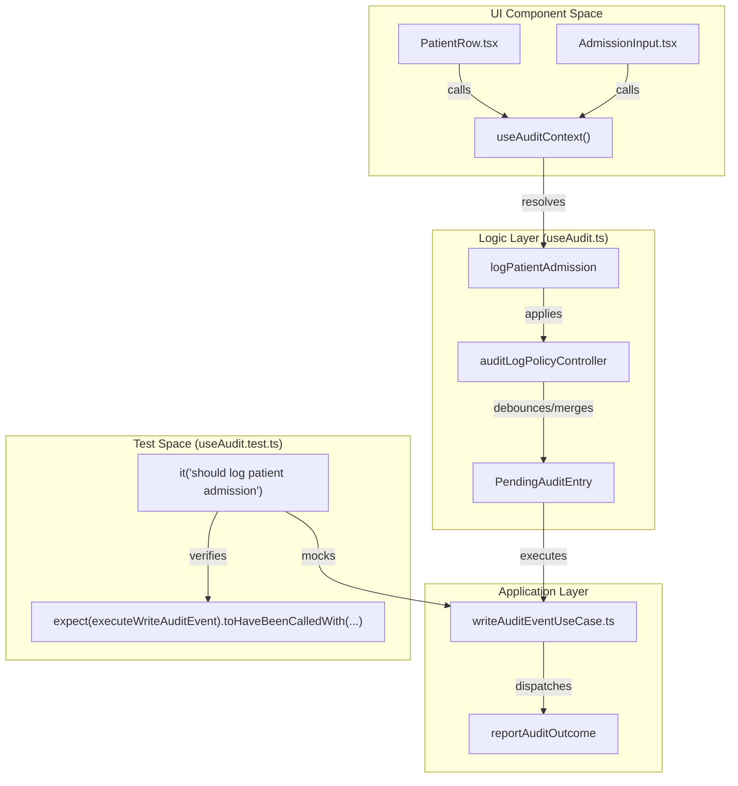
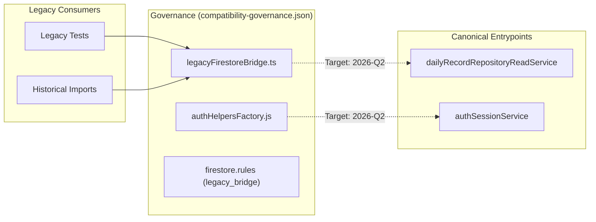

# Testing Strategy & E2E

# Testing Strategy & E2E

Relevant source files

The following files were used as context for generating this wiki page:

- [docs/AUDIT_2026-05_PILOT_FACADE_OVERLAP.md](docs/AUDIT_2026-05_PILOT_FACADE_OVERLAP.md)
- [docs/GLOSSARY.md](docs/GLOSSARY.md)
- [docs/RUNBOOK_LOCAL_E2E_EMULATOR.md](docs/RUNBOOK_LOCAL_E2E_EMULATOR.md)
- [docs/testing/README.md](docs/testing/README.md)
- [docs/testing/VRT.md](docs/testing/VRT.md)
- [e2e/audit-trail.spec.ts](e2e/audit-trail.spec.ts)
- [e2e/bed-blocking.spec.ts](e2e/bed-blocking.spec.ts)
- [e2e/census-closing.spec.ts](e2e/census-closing.spec.ts)
- [e2e/census-navigation.spec.ts](e2e/census-navigation.spec.ts)
- [e2e/census-persistence-reload.spec.ts](e2e/census-persistence-reload.spec.ts)
- [e2e/chaos-network.spec.ts](e2e/chaos-network.spec.ts)
- [e2e/clinical-release-visual-smoke.spec.ts](e2e/clinical-release-visual-smoke.spec.ts)
- [e2e/comprehensive.spec.ts](e2e/comprehensive.spec.ts)
- [e2e/export-artifact-validation.spec.ts](e2e/export-artifact-validation.spec.ts)
- [e2e/hospitalDay.spec.ts](e2e/hospitalDay.spec.ts)
- [e2e/legacy-firebase-compat.spec.ts](e2e/legacy-firebase-compat.spec.ts)
- [e2e/startup-performance-budget.spec.ts](e2e/startup-performance-budget.spec.ts)
- [e2e/sync-conflict-resolution.spec.ts](e2e/sync-conflict-resolution.spec.ts)
- [e2e/visual-regression.spec.ts](e2e/visual-regression.spec.ts)
- [eslint.config.js](eslint.config.js)
- [lighthouserc.json](lighthouserc.json)
- [scripts/check-release-confidence-pack.mjs](scripts/check-release-confidence-pack.mjs)
- [scripts/config/compatibility-governance.json](scripts/config/compatibility-governance.json)
- [scripts/config/flow-performance-budgets.json](scripts/config/flow-performance-budgets.json)
- [scripts/config/release-confidence-pack.json](scripts/config/release-confidence-pack.json)
- [scripts/run-release-confidence-pack.mjs](scripts/run-release-confidence-pack.mjs)
- [src/context/AuditContext.tsx](src/context/AuditContext.tsx)
- [src/features/census/components/CensusModals.tsx](src/features/census/components/CensusModals.tsx)
- [src/features/census/components/CensusPrintHeader.tsx](src/features/census/components/CensusPrintHeader.tsx)
- [src/hooks/controllers/useHandoffAuditLoggers.ts](src/hooks/controllers/useHandoffAuditLoggers.ts)
- [src/hooks/useAudit.ts](src/hooks/useAudit.ts)
- [src/services/storage/sync/README.md](src/services/storage/sync/README.md)
- [src/services/storage/sync/index.ts](src/services/storage/sync/index.ts)
- [src/shared/runtime/browserWindowRuntime.ts](src/shared/runtime/browserWindowRuntime.ts)
- [src/shared/runtime/e2eRuntime.ts](src/shared/runtime/e2eRuntime.ts)
- [src/tests/build/testSetupConsoleNoiseFilter.test.ts](src/tests/build/testSetupConsoleNoiseFilter.test.ts)
- [src/tests/hooks/useAudit.handoff.test.ts](src/tests/hooks/useAudit.handoff.test.ts)
- [src/tests/hooks/useAudit.test.ts](src/tests/hooks/useAudit.test.ts)
- [src/tests/integration/concurrency.test.tsx](src/tests/integration/concurrency.test.tsx)
- [src/tests/integration/firebaseSync.test.ts](src/tests/integration/firebaseSync.test.ts)
- [src/tests/integration/masterIntegration.test.tsx](src/tests/integration/masterIntegration.test.tsx)
- [src/tests/integration/offline-persistence.test.ts](src/tests/integration/offline-persistence.test.ts)
- [src/tests/security/dailyRecordRootImportGovernanceStatic.test.ts](src/tests/security/dailyRecordRootImportGovernanceStatic.test.ts)
- [src/tests/services/auditLegacyDomainService.test.ts](src/tests/services/auditLegacyDomainService.test.ts)
- [src/tests/services/storage/syncQueueLoad.test.ts](src/tests/services/storage/syncQueueLoad.test.ts)
- [src/tests/setup.ts](src/tests/setup.ts)

The HHR (Hospital Hanga Roa) system employs a tiered testing strategy designed to ensure clinical safety, data integrity, and operational performance. The strategy moves from low-level unit tests to complex End-to-End (E2E) flows using the Firestore emulator and Playwright. This multi-layered approach is governed by automated CI gates that enforce quality requirements before any code reaches production.

## Testing Layers

The system categorizes tests into four distinct layers, each targeting specific risks within the offline-first architecture.

| Layer                  | Technology            | Scope                                                       | Key Files                       |
| :--------------------- | :-------------------- | :---------------------------------------------------------- | :------------------------------ |
| **Unit & Integration** | Vitest + RTL          | Hooks, Controllers, Repositories, and Domain logic.         | `src/tests/`                    |
| **Security & Rules**   | Firestore Emulator    | Firestore Security Rules and RBAC enforcement.              | `src/tests/security/`           |
| **E2E Critical**       | Playwright + Emulator | Auth flows, Sync conflicts, and Clinical Document creation. | `e2e/`                          |
| **Visual (VRT)**       | Playwright            | Layout density, 3D maps, and destructive dialogs.           | `e2e/visual-regression.spec.ts` |

### Test Setup & Mocking Infrastructure

The testing environment is configured in `src/tests/setup.ts` [src/tests/setup.ts:1-135](). It provides:

- **Global Mocks**: Stubs for `localStorage`, `sessionStorage`, `Worker`, and `crypto.randomUUID` [src/tests/setup.ts:102-161]().
- **Firebase Mocks**: A comprehensive mock of Firebase Auth and Firestore for unit tests [src/tests/setup.ts:163-210]().
- **Console Noise Filtering**: A whitelist of expected operational warnings (e.g., `[SyncQueue]`, `[IndexedDB]`) to keep test logs clean [src/tests/setup.ts:10-74]().
- **IndexedDB Simulation**: Uses `fake-indexeddb` to test local persistence without a browser [src/tests/setup.ts:1-1]().

**Sources:** [src/tests/setup.ts:1-210](), [docs/testing/README.md:5-18]()

---

## Release Confidence & CI Gates

The project uses a "Gate" system to manage the trade-off between developer velocity and release safety.

### Release Confidence Pack

The `release-confidence-pack` is a curated set of tests that must pass to guarantee a stable release. It is defined in `scripts/config/release-confidence-pack.json` [docs/testing/README.md:125-127]().

- **Blocking Profile**: Includes `runtime_smoke`, `rules_ci`, `emulator_sync_ci`, `critical_coverage`, `flow_performance`, and `e2e_critical_ci` [docs/testing/README.md:129-137]().
- **Full Profile**: Adds `unit_critical` for deeper validation [docs/testing/README.md:138-142]().

### Automated Guardrails

Quality is enforced through scripts that check for architectural drift:

- **`check:critical-smoke-pack`**: Ensures the smoke pack covers mandatory scenarios like `cold_boot` and `sync_conflict` [docs/testing/README.md:94-107]().
- **`check:release-confidence-matrix`**: Verifies that every critical clinical area has traceability to coverage and performance budgets [docs/testing/README.md:37-37]().

**Sources:** [docs/testing/README.md:23-42](), [docs/testing/README.md:125-146]()

---

## E2E Performance Budgets

The system enforces strict performance budgets for critical user flows. These are measured using Playwright against a production build (`npm run preview`) to ensure metrics reflect real-world usage [docs/RUNBOOK_LOCAL_E2E_EMULATOR.md:52-53]().

### Flow Budget Configuration

Budgets are defined in `scripts/config/flow-performance-budgets.json` [scripts/config/flow-performance-budgets.json:1-29]().

| Flow                         | Target (ms) | Enforced Max (ms) | Description                                    |
| :--------------------------- | :---------- | :---------------- | :--------------------------------------------- |
| `loginVisibleMs`             | 4000        | 4000              | Time until Google login is interactive.        |
| `censoVisibleMs`             | 1500        | 2300              | Time until the Census table is rendered.       |
| `censoRecordReadyMs`         | 2500        | 5000              | Time until data is hydrated from local/remote. |
| `clinicalDocumentsVisibleMs` | 4500        | 6000              | Workspace load time.                           |

### Performance Enforcement Logic

The `e2e/startup-performance-budget.spec.ts` script executes these measurements [e2e/startup-performance-budget.spec.ts:1-107](). If a flow exceeds the `enforcedMaxMs`, the CI gate fails, blocking the release [docs/RUNBOOK_LOCAL_E2E_EMULATOR.md:103-104]().

**Sources:** [scripts/config/flow-performance-budgets.json:1-29](), [e2e/startup-performance-budget.spec.ts:58-91](), [docs/RUNBOOK_LOCAL_E2E_EMULATOR.md:105-110]()

---

## Visual Regression Testing (VRT)

VRT protects the UI from layout shifts and branding regressions. It uses Playwright's `toHaveScreenshot` against a set of deterministic data injected via `__HHR_E2E_OVERRIDE__` [docs/testing/VRT.md:1-18]().

### VRT Coverage

- **`login-view`**: Protects the entry point branding [docs/testing/VRT.md:13-13]().
- **`census-dashboard`**: Ensures column density and clinical alerts remain visible [docs/testing/VRT.md:14-14]().
- **`hospital-3d-map`**: Detects regressions in Three.js rendering or camera positioning [docs/testing/VRT.md:15-15]().
- **`destructive-confirm-dialog`**: Validates that warning/danger variants maintain their visual urgency [docs/testing/VRT.md:24-25]().

### VRT Governance

- **Reference OS**: `darwin` (Apple Silicon) is the standard for baseline generation [docs/testing/VRT.md:47-47]().
- **Tolerance**: Each test defines a `maxDiffPixelRatio` (0.01 to 0.10) to allow for minor anti-aliasing differences [docs/testing/VRT.md:49-49]().

**Sources:** [docs/testing/VRT.md:1-68]()

---

## Audit Testing Strategy

Audit logging is a critical clinical requirement. The system uses a specialized hook `useAudit` to log events with user context [src/hooks/useAudit.ts:1-30]().

### Audit Data Flow

The following diagram illustrates how clinical actions are transformed into persistent audit logs and how they are validated in tests.

**Clinical Audit Flow: UI to Persistence**

**Sources:** [src/hooks/useAudit.ts:172-207](), [src/context/AuditContext.tsx:147-154](), [src/tests/hooks/useAudit.test.ts:56-75]()

### Audit Test Coverage

Unit tests in `src/tests/hooks/useAudit.test.ts` ensure that every clinical action (Admission, Discharge, Transfer, Daily Record deletion) generates the correct payload for the backend [src/tests/hooks/useAudit.test.ts:32-210]().

---

## Infrastructure & Compatibility Governance

The system maintains a `compatibility-governance.json` to manage technical debt and legacy bridges during migrations [scripts/config/compatibility-governance.json:1-6]().

**Compatibility Bridge Map**

**Sources:** [scripts/config/compatibility-governance.json:7-55]()

### Legacy Retirement Criteria

Each bridge in the governance file defines a `retirementCriteria` and a `target` date (e.g., `2026-Q2`). This ensures that shims like `legacyFirestoreBridge.ts` do not remain in the codebase indefinitely [scripts/config/compatibility-governance.json:14-15]().

**Sources:** [scripts/config/compatibility-governance.json:1-57]()

---
