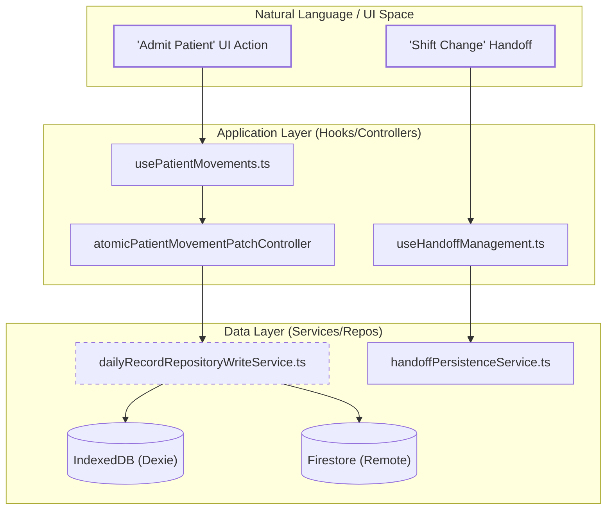
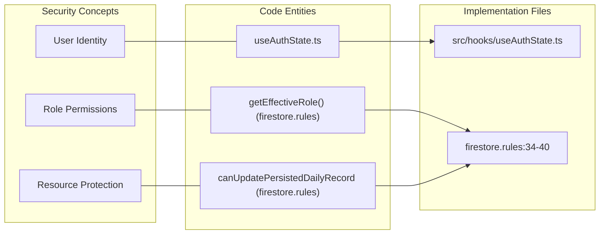

# Glossary

# Glossary

Relevant source files

The following files were used as context for generating this wiki page:

- [.github/workflows/ci-cd.yml](.github/workflows/ci-cd.yml)
- [ARCHITECTURE.md](ARCHITECTURE.md)
- [README.md](README.md)
- [docs/CI_GATES_AND_FAILURE_RUNBOOKS.md](docs/CI_GATES_AND_FAILURE_RUNBOOKS.md)
- [docs/DEVELOPER_COMMANDS.md](docs/DEVELOPER_COMMANDS.md)
- [docs/FIRESTORE_RULES_COMPLEXITY_AUDIT.md](docs/FIRESTORE_RULES_COMPLEXITY_AUDIT.md)
- [docs/MAINTENANCE_ITERATION_LOG.md](docs/MAINTENANCE_ITERATION_LOG.md)
- [docs/OPERATIVE_RULES_REFERENCE.md](docs/OPERATIVE_RULES_REFERENCE.md)
- [docs/QUALITY_GUARDRAILS.md](docs/QUALITY_GUARDRAILS.md)
- [docs/SAFE_CHANGE_CHECKLIST.md](docs/SAFE_CHANGE_CHECKLIST.md)
- [docs/system-behaviors.md](docs/system-behaviors.md)
- [firestore.rules](firestore.rules)
- [functions/index.js](functions/index.js)
- [index.html](index.html)
- [package.json](package.json)
- [playwright.emulator-critical.config.ts](playwright.emulator-critical.config.ts)
- [public/startup-surface.js](public/startup-surface.js)
- [public/version.json](public/version.json)
- [reports/legacy-bridge-governance.json](reports/legacy-bridge-governance.json)
- [reports/legacy-bridge-governance.md](reports/legacy-bridge-governance.md)
- [reports/runtime-contracts.json](reports/runtime-contracts.json)
- [reports/runtime-contracts.md](reports/runtime-contracts.md)
- [scripts/check-feature-public-api-boundary.mjs](scripts/check-feature-public-api-boundary.mjs)
- [scripts/check-quality-aggregate.mjs](scripts/check-quality-aggregate.mjs)
- [scripts/check-release-evidence.mjs](scripts/check-release-evidence.mjs)
- [scripts/check-rules-source-governance.mjs](scripts/check-rules-source-governance.mjs)
- [scripts/check-technical-ownership-map.mjs](scripts/check-technical-ownership-map.mjs)
- [scripts/config/guardrail-governance.json](scripts/config/guardrail-governance.json)
- [scripts/config/technical-ownership-map.json](scripts/config/technical-ownership-map.json)
- [scripts/feature-public-api-allowlist.json](scripts/feature-public-api-allowlist.json)
- [scripts/releaseConfidenceMatrixSupport.mjs](scripts/releaseConfidenceMatrixSupport.mjs)
- [scripts/releaseReadinessScorecardSupport.mjs](scripts/releaseReadinessScorecardSupport.mjs)
- [scripts/report-release-readiness-scorecard.mjs](scripts/report-release-readiness-scorecard.mjs)
- [scripts/report-system-confidence.mjs](scripts/report-system-confidence.mjs)
- [scripts/rulesSourceGovernanceSupport.mjs](scripts/rulesSourceGovernanceSupport.mjs)
- [src/App.tsx](src/App.tsx)
- [src/app-shell/bootstrap/appShellLoadingPolicy.ts](src/app-shell/bootstrap/appShellLoadingPolicy.ts)
- [src/application/ports/prescriptionPort.ts](src/application/ports/prescriptionPort.ts)
- [src/application/prescriptions/reassignPrescriptionPatientUseCase.ts](src/application/prescriptions/reassignPrescriptionPatientUseCase.ts)
- [src/application/prescriptions/updatePrescriptionTypeUseCase.ts](src/application/prescriptions/updatePrescriptionTypeUseCase.ts)
- [src/components/ui/InitialLoadingScreen.tsx](src/components/ui/InitialLoadingScreen.tsx)
- [src/features/analytics/controllers/minsalAnalyticsPresentationController.ts](src/features/analytics/controllers/minsalAnalyticsPresentationController.ts)
- [src/features/auth/components/LoginPage.tsx](src/features/auth/components/LoginPage.tsx)
- [src/features/auth/components/LoginPageCard.tsx](src/features/auth/components/LoginPageCard.tsx)
- [src/features/auth/components/useLoginPageController.ts](src/features/auth/components/useLoginPageController.ts)
- [src/features/clinical-documents/components/ClinicalDocumentSectionList.tsx](src/features/clinical-documents/components/ClinicalDocumentSectionList.tsx)
- [src/features/clinical-documents/components/ClinicalDocumentSheet.tsx](src/features/clinical-documents/components/ClinicalDocumentSheet.tsx)
- [src/features/clinical-documents/components/ClinicalDocumentsModal.tsx](src/features/clinical-documents/components/ClinicalDocumentsModal.tsx)
- [src/features/clinical-documents/components/ClinicalDocumentsSidebar.tsx](src/features/clinical-documents/components/ClinicalDocumentsSidebar.tsx)
- [src/features/clinical-documents/components/ClinicalDocumentsWorkspace.tsx](src/features/clinical-documents/components/ClinicalDocumentsWorkspace.tsx)
- [src/features/clinical-documents/components/clinicalDocumentSheetShared.ts](src/features/clinical-documents/components/clinicalDocumentSheetShared.ts)
- [src/features/clinical-documents/contracts/clinicalDocumentsSidebarContracts.ts](src/features/clinical-documents/contracts/clinicalDocumentsSidebarContracts.ts)
- [src/features/clinical-documents/controllers/clinicalDocumentsWorkspaceViewModel.ts](src/features/clinical-documents/controllers/clinicalDocumentsWorkspaceViewModel.ts)
- [src/features/clinical-documents/domain/rules.ts](src/features/clinical-documents/domain/rules.ts)
- [src/features/clinical-documents/hooks/clinicalDocumentDraftReducer.ts](src/features/clinical-documents/hooks/clinicalDocumentDraftReducer.ts)
- [src/features/clinical-documents/hooks/useClinicalDocumentWorkspaceDocumentActions.ts](src/features/clinical-documents/hooks/useClinicalDocumentWorkspaceDocumentActions.ts)
- [src/features/clinical-documents/hooks/useClinicalDocumentWorkspaceDraft.ts](src/features/clinical-documents/hooks/useClinicalDocumentWorkspaceDraft.ts)
- [src/features/clinical-documents/hooks/useClinicalDocumentsWorkspaceModel.ts](src/features/clinical-documents/hooks/useClinicalDocumentsWorkspaceModel.ts)
- [src/features/clinical-documents/services/clinicalDocumentPdfService.ts](src/features/clinical-documents/services/clinicalDocumentPdfService.ts)
- [src/features/clinical-documents/services/clinicalDocumentPrintPdfService.ts](src/features/clinical-documents/services/clinicalDocumentPrintPdfService.ts)
- [src/features/clinical-documents/styles/clinicalDocumentSheet.css](src/features/clinical-documents/styles/clinicalDocumentSheet.css)
- [src/features/cudyr/README.md](src/features/cudyr/README.md)
- [src/features/cudyr/components/CudyrHeader.tsx](src/features/cudyr/components/CudyrHeader.tsx)
- [src/features/cudyr/components/CudyrRow.tsx](src/features/cudyr/components/CudyrRow.tsx)
- [src/features/cudyr/components/CudyrView.tsx](src/features/cudyr/components/CudyrView.tsx)
- [src/features/cudyr/controllers/cudyrEligibilityController.ts](src/features/cudyr/controllers/cudyrEligibilityController.ts)
- [src/features/cudyr/controllers/cudyrRowViewController.ts](src/features/cudyr/controllers/cudyrRowViewController.ts)
- [src/features/cudyr/controllers/cudyrViewController.ts](src/features/cudyr/controllers/cudyrViewController.ts)
- [src/features/cudyr/hooks/useCudyrLogic.ts](src/features/cudyr/hooks/useCudyrLogic.ts)
- [src/features/handoff/components/HandoffRowCells.tsx](src/features/handoff/components/HandoffRowCells.tsx)
- [src/features/handoff/controllers/handoffRowCellsController.ts](src/features/handoff/controllers/handoffRowCellsController.ts)
- [src/features/laboratory/controllers/labAnalyticsController.ts](src/features/laboratory/controllers/labAnalyticsController.ts)
- [src/features/prescriptions/components/PrescriptionBedGridView.tsx](src/features/prescriptions/components/PrescriptionBedGridView.tsx)
- [src/features/prescriptions/components/PrescriptionBedRow.tsx](src/features/prescriptions/components/PrescriptionBedRow.tsx)
- [src/features/prescriptions/components/PrescriptionImageLightbox.tsx](src/features/prescriptions/components/PrescriptionImageLightbox.tsx)
- [src/features/prescriptions/components/PrescriptionPatientLightbox.tsx](src/features/prescriptions/components/PrescriptionPatientLightbox.tsx)
- [src/features/prescriptions/components/PrescriptionQuickTypeButton.tsx](src/features/prescriptions/components/PrescriptionQuickTypeButton.tsx)
- [src/features/prescriptions/components/PrescriptionThumbnail.tsx](src/features/prescriptions/components/PrescriptionThumbnail.tsx)
- [src/features/prescriptions/components/PrescriptionUnassignedTray.tsx](src/features/prescriptions/components/PrescriptionUnassignedTray.tsx)
- [src/features/prescriptions/components/PrescriptionVisorView.tsx](src/features/prescriptions/components/PrescriptionVisorView.tsx)
- [src/hooks/controllers/authBootstrapController.ts](src/hooks/controllers/authBootstrapController.ts)
- [src/hooks/controllers/authResolvedStateSubscription.ts](src/hooks/controllers/authResolvedStateSubscription.ts)
- [src/hooks/controllers/censusEmailRecipientRuntimeController.ts](src/hooks/controllers/censusEmailRecipientRuntimeController.ts)
- [src/hooks/useAuthState.ts](src/hooks/useAuthState.ts)
- [src/hooks/useAuthStateSupport.ts](src/hooks/useAuthStateSupport.ts)
- [src/hooks/useCensusEmailRecipientLists.ts](src/hooks/useCensusEmailRecipientLists.ts)
- [src/index.tsx](src/index.tsx)
- [src/schemas/prescriptionSchemas.ts](src/schemas/prescriptionSchemas.ts)
- [src/services/auth/authStorageHints.ts](src/services/auth/authStorageHints.ts)
- [src/services/auth/authUiCopy.ts](src/services/auth/authUiCopy.ts)
- [src/services/cudyr/cudyrSummary.ts](src/services/cudyr/cudyrSummary.ts)
- [src/services/repositories/ClinicalDocumentTemplateRepository.ts](src/services/repositories/ClinicalDocumentTemplateRepository.ts)
- [src/services/repositories/PrescriptionRepository.ts](src/services/repositories/PrescriptionRepository.ts)
- [src/services/repositories/conflictResolutionDeviceMergeUtils.ts](src/services/repositories/conflictResolutionDeviceMergeUtils.ts)
- [src/services/repositories/conflictResolutionMatrix.ts](src/services/repositories/conflictResolutionMatrix.ts)
- [src/services/repositories/conflictResolutionMergeUtils.ts](src/services/repositories/conflictResolutionMergeUtils.ts)
- [src/services/repositories/conflictResolutionPolicy.ts](src/services/repositories/conflictResolutionPolicy.ts)
- [src/services/repositories/conflictResolutionStaffingMergeUtils.ts](src/services/repositories/conflictResolutionStaffingMergeUtils.ts)
- [src/services/repositories/conflictResolutionTrace.ts](src/services/repositories/conflictResolutionTrace.ts)
- [src/services/repositories/dailyRecordMasterSyncController.ts](src/services/repositories/dailyRecordMasterSyncController.ts)
- [src/services/repositories/dailyRecordWriteSupport.ts](src/services/repositories/dailyRecordWriteSupport.ts)
- [src/services/storage/indexeddb/indexedDbMaintenanceService.ts](src/services/storage/indexeddb/indexedDbMaintenanceService.ts)
- [src/tests/README.md](src/tests/README.md)
- [src/tests/app-shell/BootstrapRouteChrome.test.tsx](src/tests/app-shell/BootstrapRouteChrome.test.tsx)
- [src/tests/app-shell/appShellLoadingPolicy.test.ts](src/tests/app-shell/appShellLoadingPolicy.test.ts)
- [src/tests/app-shell/bootstrapRuntimeTelemetry.test.ts](src/tests/app-shell/bootstrapRuntimeTelemetry.test.ts)
- [src/tests/build/releaseConfidenceMatrixSupport.test.ts](src/tests/build/releaseConfidenceMatrixSupport.test.ts)
- [src/tests/build/releaseEvidence.test.ts](src/tests/build/releaseEvidence.test.ts)
- [src/tests/build/releaseReadinessScorecardSupport.test.ts](src/tests/build/releaseReadinessScorecardSupport.test.ts)
- [src/tests/components/AppLoadingBehavior.test.tsx](src/tests/components/AppLoadingBehavior.test.tsx)
- [src/tests/components/BookmarkEditorModal.test.tsx](src/tests/components/BookmarkEditorModal.test.tsx)
- [src/tests/components/InitialLoadingScreen.test.tsx](src/tests/components/InitialLoadingScreen.test.tsx)
- [src/tests/components/index.bootstrap.test.tsx](src/tests/components/index.bootstrap.test.tsx)
- [src/tests/components/useAppContentShellEffects.test.tsx](src/tests/components/useAppContentShellEffects.test.tsx)
- [src/tests/components/useBookmarkImport.test.ts](src/tests/components/useBookmarkImport.test.ts)
- [src/tests/emulator/sync-concurrency.emulator.test.ts](src/tests/emulator/sync-concurrency.emulator.test.ts)
- [src/tests/features/analytics/AnalyticsView.test.tsx](src/tests/features/analytics/AnalyticsView.test.tsx)
- [src/tests/features/analytics/minsalAnalyticsPresentationController.test.ts](src/tests/features/analytics/minsalAnalyticsPresentationController.test.ts)
- [src/tests/features/auth/LoginPageCard.test.tsx](src/tests/features/auth/LoginPageCard.test.tsx)
- [src/tests/features/auth/useLoginPageController.test.ts](src/tests/features/auth/useLoginPageController.test.ts)
- [src/tests/features/census/global-search/globalSearchContracts.test.ts](src/tests/features/census/global-search/globalSearchContracts.test.ts)
- [src/tests/features/clinical-documents/ClinicalDocumentSheet.test.tsx](src/tests/features/clinical-documents/ClinicalDocumentSheet.test.tsx)
- [src/tests/features/clinical-documents/ClinicalDocumentsSidebar.test.tsx](src/tests/features/clinical-documents/ClinicalDocumentsSidebar.test.tsx)
- [src/tests/features/clinical-documents/ClinicalDocumentsWorkspace.test.tsx](src/tests/features/clinical-documents/ClinicalDocumentsWorkspace.test.tsx)
- [src/tests/features/clinical-documents/useClinicalDocumentWorkspaceDocumentActions.test.ts](src/tests/features/clinical-documents/useClinicalDocumentWorkspaceDocumentActions.test.ts)
- [src/tests/features/cudyr/CudyrHeader.test.tsx](src/tests/features/cudyr/CudyrHeader.test.tsx)
- [src/tests/features/cudyr/cudyrEligibilityController.test.ts](src/tests/features/cudyr/cudyrEligibilityController.test.ts)
- [src/tests/features/cudyr/cudyrRowViewController.test.ts](src/tests/features/cudyr/cudyrRowViewController.test.ts)
- [src/tests/features/cudyr/cudyrViewController.test.ts](src/tests/features/cudyr/cudyrViewController.test.ts)
- [src/tests/features/prescriptions/PrescriptionBedGridView.test.tsx](src/tests/features/prescriptions/PrescriptionBedGridView.test.tsx)
- [src/tests/features/prescriptions/PrescriptionQuickTypeButton.test.tsx](src/tests/features/prescriptions/PrescriptionQuickTypeButton.test.tsx)
- [src/tests/features/prescriptions/PrescriptionVisorView.test.tsx](src/tests/features/prescriptions/PrescriptionVisorView.test.tsx)
- [src/tests/features/prescriptions/prescriptionRuntimeContracts.test.ts](src/tests/features/prescriptions/prescriptionRuntimeContracts.test.ts)
- [src/tests/features/whatsapp/StaffCard.test.tsx](src/tests/features/whatsapp/StaffCard.test.tsx)
- [src/tests/hooks/controllers/authBootstrapController.test.ts](src/tests/hooks/controllers/authBootstrapController.test.ts)
- [src/tests/hooks/controllers/censusEmailRecipientRuntimeController.test.ts](src/tests/hooks/controllers/censusEmailRecipientRuntimeController.test.ts)
- [src/tests/hooks/useAuthState.test.ts](src/tests/hooks/useAuthState.test.ts)
- [src/tests/hooks/useAuthStateSupport.sessionResolution.test.tsx](src/tests/hooks/useAuthStateSupport.sessionResolution.test.tsx)
- [src/tests/hooks/useAuthStateSupport.testUtils.ts](src/tests/hooks/useAuthStateSupport.testUtils.ts)
- [src/tests/security/firestoreRulesAccessGroups.ts](src/tests/security/firestoreRulesAccessGroups.ts)
- [src/tests/security/firestoreRulesEmulatorConfig.test.ts](src/tests/security/firestoreRulesEmulatorConfig.test.ts)
- [src/tests/security/firestoreRulesEmulatorConfig.ts](src/tests/security/firestoreRulesEmulatorConfig.ts)
- [src/tests/security/firestoreRulesTestHarness.ts](src/tests/security/firestoreRulesTestHarness.ts)
- [src/tests/security/prescriptionConstantsDriftStatic.test.ts](src/tests/security/prescriptionConstantsDriftStatic.test.ts)
- [src/tests/security/startupPrebootContractStatic.test.ts](src/tests/security/startupPrebootContractStatic.test.ts)
- [src/tests/services/auth/authFlowRuntime.test.ts](src/tests/services/auth/authFlowRuntime.test.ts)
- [src/tests/services/auth/authRuntimeSupport.test.ts](src/tests/services/auth/authRuntimeSupport.test.ts)
- [src/tests/services/calculations/cudyrSummary.test.ts](src/tests/services/calculations/cudyrSummary.test.ts)
- [src/tests/services/observability/operationalTelemetryService.test.ts](src/tests/services/observability/operationalTelemetryService.test.ts)
- [src/tests/services/repositories/PrescriptionRepository.test.ts](src/tests/services/repositories/PrescriptionRepository.test.ts)
- [src/tests/services/repositories/conflictResolutionMatrix.test.ts](src/tests/services/repositories/conflictResolutionMatrix.test.ts)
- [src/tests/services/repositories/dailyRecordMasterSyncController.test.ts](src/tests/services/repositories/dailyRecordMasterSyncController.test.ts)
- [src/tests/services/repositories/dailyRecordRepositoryWriteServiceAutoMerge.test.ts](src/tests/services/repositories/dailyRecordRepositoryWriteServiceAutoMerge.test.ts)
- [src/tests/services/storage/indexedDBService.test.ts](src/tests/services/storage/indexedDBService.test.ts)
- [src/tests/views/cudyr/CudyrView.test.tsx](src/tests/views/cudyr/CudyrView.test.tsx)
- [src/tests/views/handoff/handoffRowCellsController.test.ts](src/tests/views/handoff/handoffRowCellsController.test.ts)

This page provides a technical glossary of domain-specific terms, architectural patterns, and clinical concepts used within the HHR (Hospital Hanga Roa) system. It serves as a bridge between clinical requirements and the implementation details found in the codebase.

## 1. Core Architectural Concepts

### DailyRecord

The central aggregate entity of the system. It represents the entire state of the hospital (beds, patients, staffing, and clinical events) for a specific ISO date (e.g., `2024-05-20`).

- **Implementation**: Defined in `src/services/storage/storageDailyRecordContracts.ts` and validated via Zod in `src/schemas/zodDailyRecordSchemas.ts`.
- **Persistence**: Stored in Firestore under the `dailyRecords` collection and cached locally in IndexedDB.

### Offline-First & LWW (Last-Write-Wins)

The system prioritizes local availability. Mutations are written to a local outbox and synchronized to Firestore. Conflict resolution follows a "Last-Write-Wins" strategy at the field level, managed by the `resolveDailyRecordConflict` function.

- **Code Pointers**: `src/services/repositories/conflictResolutionMatrix.ts` [1-10](), `src/services/storage/syncQueueEngine.ts`.

### Repository Pattern

The system uses a repository layer to abstract the complexities of multi-source data (IndexedDB + Firestore).

- **Read Service**: `dailyRecordRepositoryReadService.ts` handles "Golden Path" reads (Local -> Remote Hydration).
- **Write Service**: `dailyRecordRepositoryWriteService.ts` handles integrity guards and outbox queuing.

---

## 2. Clinical Domain Terms

| Term          | Definition                                                                                           | Code Reference                                               |
| :------------ | :--------------------------------------------------------------------------------------------------- | :----------------------------------------------------------- |
| **CUDYR**     | "Cuidados y Dependencia". A clinical scoring system used to categorize patient nursing requirements. | `src/features/handoff/components/CudyrRow.tsx`               |
| **CMA**       | "Cirugía Mayor Ambulatoria". Represents patients undergoing same-day surgical procedures.            | `src/types/dailyRecordTypes.ts`                              |
| **UPC**       | "Unidad de Paciente Crítico". High-acuity beds (Intermediate/Intensive care).                        | `src/features/census/components/UpcChecklistPopover.tsx`     |
| **Fuga**      | An administrative event where a patient leaves the hospital without a formal discharge.              | `src/services/whatsapp/fugaNotificationService.ts`           |
| **Epicrisis** | A medical discharge summary document.                                                                | `src/features/clinical-documents/types.ts`                   |
| **IEEH**      | "Informe Estadístico de Egreso Hospitalario". A mandatory statistical report for discharges.         | `src/features/clinical-documents/services/ieehPdfService.ts` |

---

## 3. System States & Lifecycle

### Bootstrap Lifecycle

The multi-stage process of initializing the application, verifying the version, resolving authentication, and rehydrating the local database.

- **Phases**: `reconcileBootstrapRuntime` -> `version.json` check -> `useResolvedAuthBootstrap`.
- **Source**: `src/app-shell/bootstrap/appShellLoadingPolicy.ts` [1-20]().

### Intentional Clear

A heuristic used during conflict resolution. If a field (like a patient name) is explicitly cleared on one device while being edited on another, the system must decide whether the "empty" state was an intentional deletion or a stale update.

- **Logic**: `src/services/repositories/conflictResolutionMergeUtils.ts`.

### Legacy Bridge

A compatibility layer that allows the current system to read and migrate data from the previous Firebase implementation (Legacy HHR).

- **Governance**: Regulated by `reports/legacy-bridge-governance.json` [1-15]().

---

## 4. Technical Abbreviations

- **RBAC**: Role-Based Access Control. Managed via `firestore.rules` and the `checkUserRole` callable.
- **VRT**: Visual Regression Testing. Implemented using Playwright to compare UI snapshots.
- **LWW**: Last-Write-Wins. The concurrency strategy for Firestore sync.
- **FOUC**: Flash of Unstyled Content. Prevented during bootstrap by the `BootstrapRouteChrome`.

---

## 5. Mapping: Natural Language to Code Entities

The following diagrams illustrate how clinical and operational concepts map to specific classes and functions in the codebase.

### Clinical Workflow to Code Mapping

"This diagram shows how a clinical action (like admitting a patient) traverses the system layers."

**Sources**: `src/features/census/hooks/usePatientMovements.ts` [1-50](), `src/services/repositories/dailyRecordRepositoryWriteService.ts` [1-100]().

### Authentication & Authorization Mapping

"This diagram maps security concepts to the specific rules and services that enforce them."

**Sources**: `firestore.rules` [34-40](), `src/hooks/useAuthState.ts` [1-30]().

---

## 6. Detailed Terminology Table

| Term                    | Implementation Detail                                                                     | Relevant Files                                                   |
| :---------------------- | :---------------------------------------------------------------------------------------- | :--------------------------------------------------------------- |
| **Sync Queue**          | A persistent outbox in IndexedDB that stores mutations while offline.                     | `src/services/storage/syncQueueEngine.ts`                        |
| **Device ID**           | A unique identifier for the browser tab, used to prevent echo-updates during sync.        | `src/services/storage/indexedDbCore.ts`                          |
| **AdmissionDatePolicy** | Rules governing which dates a patient can be admitted to (e.g., preventing future dates). | `src/services/repositories/dailyRecordRepositoryWriteService.ts` |
| **Hard Reset**          | A maintenance function that clears all local IndexedDB data and re-syncs from Firestore.  | `src/services/storage/indexedDbMaintenanceService.ts`            |
| **Clinical Day**        | The logical boundary for clinical records, usually defined by the ISO date string.        | `src/domain/clinicalDayUtilities.ts`                             |

**Sources**:

- `package.json` [1-50]()
- `firestore.rules` [1-100]()
- `src/services/repositories/conflictResolutionMatrix.ts` [1-50]()
- `reports/legacy-bridge-governance.json` [1-20]()
- `src/app-shell/bootstrap/appShellLoadingPolicy.ts` [1-40]()
